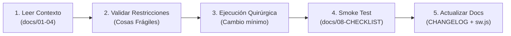

# 00 - PROTOCOLO MAESTRO DE DESARROLLO Y PLANTILLAS DE PROMPT

> **Documento de Gobernanza Técnica y Control de Calidad Asistido por IA**  
> **Sistema:** Petulap SST  
> **Destinatario:** Propietarios del proyecto, desarrolladores y agentes de IA (Antigravity, Claude, ChatGPT, etc.)  
> **Objetivo:** Garantizar que **cualquier cambio futuro** respete la arquitectura establecida, no rompa reglas críticas ("Cosas Frágiles") y mantenga la documentación y el `CHANGELOG.md` permanentemente actualizados y sincronizados.

---

## 1. El Ciclo Obligatorio de Todo Cambio (Protocolo de 5 Pasos)

Cada vez que se solicite un cambio (sea agregar una función, corregir un error o ajustar una vista), la IA o el programador debe seguir obligatoriamente este ciclo:



1. **Leer Documentación Relevante:** Antes de tocar código, consultar el módulo afectado en `docs/`.
2. **Respetar "Cosas Frágiles":** Cumplir la Sección 7 de `03-FRONTEND.md` y las reglas de seguridad de `02-REMEDIACION-EMERGENCIA.md`.
3. **Intervención Quirúrgica:** Modificar únicamente lo necesario. No rehacer pantallas completas ni agregar librerías externas.
4. **Verificación Previa (Smoke Test):** Validar contra `docs/08-CHECKLIST-TESTING.md`.
5. **Cierre Documental Obligatorio:** Registrar el cambio en `CHANGELOG.md` e incrementar versión en `sw.js` si se tocaron CSS o JS.

---

## 2. Las 7 Reglas de Oro Innegociables (Cosas Frágiles)

Cualquier cambio que viole alguna de estas reglas será rechazado de inmediato:

| # | Regla | ¿Por Qué es Crítica? |
| :-: | :--- | :--- |
| **1** | **Orden CSS en `<head>`:**<br>`tokens.css` $\rightarrow$ `styles.css` $\rightarrow$ `dashboard.css` | Si se invierte o se omite `tokens.css`, las variables colapsan y la pantalla se muestra con fondos y textos blancos invisibles. |
| **2** | **Identificadores DOM Protegidos:**<br>`#mobile-menu-toggle`, `#mobile-sidebar`, `#lbl-nombre`, `#lbl-tecnico`, `.fab-chat`, `.notification-btn`, `#notif-dropdown`, `#notif-badge` | Son consumidos globalmente por `dashboard.js` y `check_auth.js`. Renombrarlos o borrarlos rompe el menú móvil, las alertas o la barra de usuario en todo el sistema. |
| **3** | **Coincidencia Exacta de `href`:**<br>Minúsculas, sin `./`, sin mayúsculas, sin parámetros (ej: `soporte.html`). | `check_auth.js` compara el texto exacto con la tabla `roles_config`. Un error como `Soporte.html` oculta el módulo del menú automáticamente. |
| **4** | **Anti-parpadeo de Modo Oscuro:**<br>Script en línea al inicio del `<head>` leyendo `localStorage.getItem('petulap-theme')`. | Previene el fogonazo blanco (*FOUC*) al recargar o navegar entre pantallas en entornos oscuros. |
| **5** | **Consultas SQL 100% Preparadas:**<br>Usar siempre `$stmt = $conn->prepare(...)` y `bind_param()`. | Prohibido concatenar variables directas en SQL (`"... WHERE id = $id"`). Previene ataques de Inyección SQL. |
| **6** | **Seguridad Backend Obligatoria:**<br>Todo endpoint en `api/` debe validar sesión activa y privilegios de rol (`check_api_access`). | Impide que usuarios sin permisos o llamadas anónimas ejecuten borrados, exportaciones o consultas sensibles. |
| **7** | **Zero Dependencias Externas:**<br>Vanilla JS puro, CSS nativo con `@media`. | No instalar Bootstrap, Tailwind, jQuery ni paquetes que aumenten el peso o requieran procesos de compilación (npm/build). |

---

## 3. Plantilla Maestra de Prompt para Futuros Cambios

> **Instrucciones para el Usuario:**  
> Copia y pega el siguiente bloque en un chat nuevo de Antigravity cada vez que quieras implementar algo nuevo. Solo completa los corchetes `[...]` de la sección **DEFINICIÓN DEL CAMBIO**.

```markdown
ROL: Actúa como Ingeniero de Software Fullstack Senior para el proyecto Petulap SST.

CONTEXTO OBLIGATORIO DE ARQUITECTURA:
Antes de generar código o modificar cualquier archivo, consulta los documentos maestros en docs/:
- docs/01-ARQUITECTURA.md (Estructura general)
- docs/02-BACKEND.md (Endpoints de la API y modelo de base de datos)
- docs/03-FRONTEND.md (Interfaces, componentes compartidos y Sección 7: 'Cosas Frágiles')
- docs/05-CHANGELOG.md (Historial de cambios y formato SemVer)
- docs/08-CHECKLIST-TESTING.md (Protocolo de pruebas de humo)
- docs/10-REMEDIACION-NAVEGACION-MOVIL.md (Estandarización de menú móvil en 20 pantallas)
- docs/11-REMEDIACION-UI-INNERHTML-Y-LOGIN.md (Erradicación de HTML crudo, saneamiento de alertas y pulido de login)
- docs/12-SISTEMA-DE-DISENO-UI-UX.md (Sistema oficial de diseño UI/UX, componentes en vivo, heatmaps y tokens semánticos)

REGLAS GENERALES INNEGOCIABLES:
1. Jerarquía CSS estricta: tokens.css -> styles.css -> dashboard.css.
2. Identificadores protegidos: NO renombrar ni borrar #mobile-menu-toggle, #mobile-sidebar, #lbl-nombre, #lbl-tecnico, .fab-chat, .notification-btn, #notif-dropdown, #notif-badge.
3. Hrefs exactos: Coincidencia milimétrica de enlaces en minúsculas (sin ./ ni mayúsculas).
4. Modo oscuro: Preservar el script anti-flicker intacto al inicio del <head>.
5. Seguridad Backend: Sentencias preparadas (bind_param) y validación estricta de sesión y rol en api/.
6. Enfoque quirúrgico: Modificaciones mínimas y limpias. Cero librerías externas (Vanilla JS/CSS nativo).

=======================================================
DEFINICIÓN DEL CAMBIO SOLICITADO:
- Módulo o Pantalla a intervenir: [EJEMPLO: website_files/caja.html y api/soporte.php]
- Tipo de Intervención: [Added / Changed / Fixed / Security]
- Descripción del cambio: [DESCRIBE AQUÍ QUÉ QUIERES QUE HAGA EL SISTEMA]
- Regla de Negocio o Criterio de Aceptación: [DESCRIBE CÓMO SABEMOS QUE FUNCIONA BIEN]
=======================================================

TAREAS DE EJECUCIÓN:
1. Aplica la modificación de código respetando las reglas de arquitectura y diseño responsive (@media <= 768px).
2. Si modificaste CSS o JS visual, incrementa la versión de caché en website_files/sw.js (ej: de 'petulap-v8' a 'petulap-v9') para que los clientes reciban el cambio automáticamente.
3. Si agregaste o modificaste endpoints PHP o tablas MySQL, actualiza la tabla correspondiente en docs/02-BACKEND.md.
4. Actualiza OBLIGATORIAMENTE CHANGELOG.md y docs/05-CHANGELOG.md bajo la versión correspondiente, siguiendo el estándar 'Keep a Changelog' y explicando el "POR QUÉ" técnico y operativo del cambio.
5. Ejecuta una verificación mental contra los casos de prueba de docs/08-CHECKLIST-TESTING.md para asegurar que no se introdujo ninguna regresión.

ENTREGABLES:
- Código modificado con explicación clara de los cambios.
- Entrada exacta agregada al CHANGELOG.md.
- Confirmación de que las 'Cosas Frágiles' no fueron alteradas.
```

---

## 4. Sub-Plantillas Especializadas por Tipo de Tarea

Si el cambio es muy específico, puedes usar una de estas plantillas recortadas:

### 4.1. Para Nuevas Funcionalidades o Módulos (`[Added]`)
```markdown
ROL: Arquitecto / Desarrollador Frontend Senior.
TAREA: Agregar [NOMBRE DE LA FUNCIONALIDAD] en la pantalla [NOMBRE_PANTALLA.html].
RESTRICCIONES:
- Cargar tokens.css, styles.css y dashboard.js en el orden estándar.
- Incluir check_auth.js y registrar sw.js.
- Usar variables var(--bg-card), var(--primary), etc., para soporte nativo de modo oscuro.
- Diseñar la vista adaptativa para móviles (tarjetas apiladas si hay datos tabulares).
- Registrar en CHANGELOG.md bajo la sección [Added] con el 'Por qué'.
```

### 4.2. Para Corrección de Errores o Bugs (`[Fixed]`)
```markdown
ROL: Ingeniero de Soporte y Depuración Senior.
TAREA: Corregir el siguiente error: [DESCRIPCIÓN DEL ERROR / COMPORTAMIENTO ESPERADO].
RESTRICCIONES:
- Identificar la causa raíz antes de tocar código.
- Modificar exclusivamente las líneas responsables (intervención quirúrgica).
- No alterar funciones periféricas ni identificadores globales.
- Documentar en CHANGELOG.md bajo la sección [Fixed] explicando causa y solución.
```

### 4.3. Para Blindaje de Seguridad en Backend (`[Security]`)
```markdown
ROL: Especialista en Ciberseguridad y Backend PHP/MySQL.
TAREA: Asegurar el endpoint [api/ARCHIVO.php].
RESTRICCIONES:
- Validar sesión activa ($_SESSION['user_id']) y permisos de rol (check_api_access).
- Convertir todas las consultas a sentencias preparadas ($stmt = $conn->prepare() + bind_param).
- Retornar siempre respuestas uniformes en formato JSON con código HTTP apropiado (401, 403, 200).
- Registrar en CHANGELOG.md bajo la sección [Security].
### 4.4. Para Rediseño UI/UX y Modernización Visual (`[Changed] / [UI-UX]`)
```markdown
ROL: Diseñador UI/UX & Lead Frontend Engineer.
TAREA: Modernizar y elevar la interfaz de la pantalla [NOMBRE_PANTALLA.html] bajo el estándar ejecutivo SaaS.
REFERENCIA OBLIGATORIA:
- Consultar docs/12-SISTEMA-DE-DISENO-UI-UX.md (Tokens, .live-chip, .pulse-dot, .live-tech-card, etc.).
- Consultar docs/03-FRONTEND.md (Sección 7: 'Cosas Frágiles').
RESTRICCIONES:
- Cero librerías externas (solo Vanilla CSS, CSS Grid, Flexbox y Phosphor Icons).
- Soporte 100% de Modo Oscuro consumiendo estrictamente variables semánticas: var(--bg-surface), var(--bg-card), var(--text-primary), var(--border-default).
- Indicadores de estado vivos: Usar .live-chip y puntos pulsantes .pulse-dot (@keyframes pulse-*).
- En pantallas móviles (<= 768px): Controles apilados verticalmente y contenedores con scroll horizontal táctil para tablas o matrices densas.
- Incrementar versión en sw.js (ej: petulap-v13 -> petulap-v14).
- Registrar en CHANGELOG.md bajo [Changed].
```

---

## 5. Resumen de Archivos de Documentación del Sistema

Para referencia rápida de qué archivo consultar según la necesidad:

| Archivo | Contenido |
| :--- | :--- |
| `docs/00-PROTOCOLO-DE-CAMBIOS-Y-PROMPTS.md` | Este protocolo maestro y plantillas de prompts para desarrollo asistido por IA. |
| `docs/01-ARQUITECTURA.md` | Flujo de datos general, pila tecnológica y mapa integral del sistema. |
| `docs/02-BACKEND.md` | Diccionario de tablas MySQL, relaciones y catálogo completo de endpoints PHP. |
| `docs/02-REMEDIACION-EMERGENCIA.md` | Registro de mitigaciones de seguridad crítica (clave 123456, scripts aislados). |
| `docs/03-FRONTEND.md` | Inventario de 23 pantallas HTML, scripts JS y guía de "Cosas Frágiles". |
| `docs/03-GESTION-SEGURA-CREDENCIALES.md` | Pautas de manejo de credenciales de base de datos y llaves API. |
| `docs/04-PREVENCION-SQL-INJECTION.md` | Guía de parametrización con sentencias preparadas en backend. |
| `docs/05-CHANGELOG.md` / `CHANGELOG.md` | Bitácora oficial de cambios históricos y versiones SemVer. |
| `docs/06-REMEDIACION-FRONTEND-PARTE1.md` | Limpieza de archivos huérfanos, scripts omitidos y Service Worker v8. |
| `docs/07-REMEDIACION-FRONTEND-PARTE2.md` | Rediseño responsive móvil de tablas densas y Kanban vertical. |
| `docs/08-CHECKLIST-TESTING.md` | Protocolo de pruebas de humo pre-despliegue en 15 minutos. |
| `docs/09-ESCALABILIDAD.md` | Plan proyectivo de cuellos de botella y arquitectura a escala 100x. |
| `docs/10-REMEDIACION-NAVEGACION-MOVIL.md` | Estandarización de navegación móvil y 4 módulos en mobile-sidebar (v1.4.0). |
| `docs/11-REMEDIACION-UI-INNERHTML-Y-LOGIN.md` | Erradicación de HTML crudo, saneamiento de alertas y pulido de login (v1.4.1). |
| `docs/12-SISTEMA-DE-DISENO-UI-UX.md` | Sistema oficial de diseño UI/UX: componentes en vivo, heatmaps, chips y tokens. |

