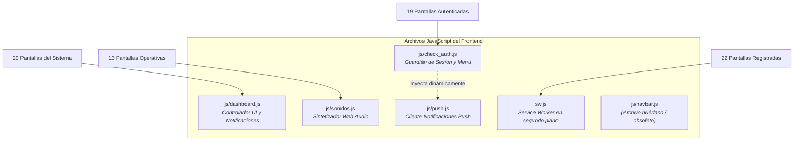
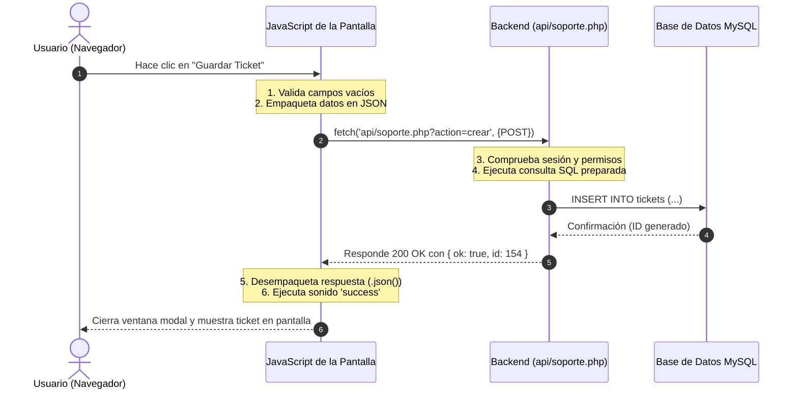
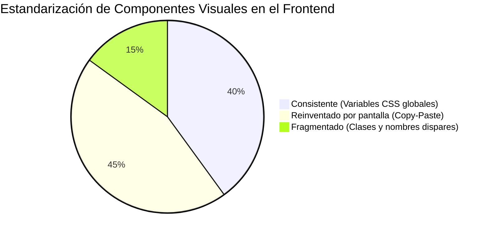
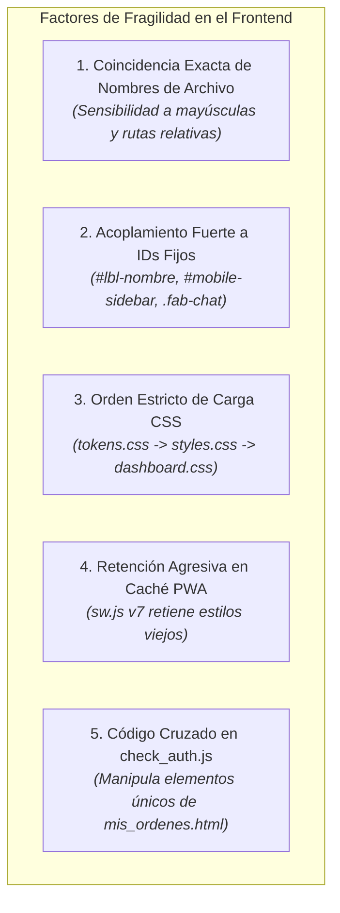

# 03 - MANUAL Y ARQUITECTURA TÉCNICA DEL FRONTEND (HTML / CSS / JAVASCRIPT)

> **Documento de Referencia Técnica y Mantenimiento de Interfaces de Usuario**  
> **Destinatario:** Propietarios del sistema, administradores y desarrolladores web  
> **Enfoque:** Lenguaje claro, estructurado y accesible para personas sin formación técnica  
> **Modo de Operación:** Documentación exhaustiva en solo lectura del lado cliente (*frontend*)  

---

## Introducción: ¿Qué es el "Frontend" de este Sistema?

En el desarrollo web, el **frontend** (la parte frontal o interfaz visible de usuario) es todo lo que una persona ve, toca y experimenta en la pantalla de su computadora, celular o tablet al abrir el sistema.

El frontend de Petulap SST está construido utilizando los tres pilares estándar de la web moderna:
1. **HTML** (*Lenguaje de Marcado de Hipertexto*): Es el esqueleto o estructura de las páginas (los textos, botones, cajas de texto para escribir, tablas e imágenes).
2. **CSS** (*Hojas de Estilo en Cascada*): Es la estética y diseño visual (los colores, tamaños de letra, espaciados, bordes redondeados y el modo oscuro).
3. **JavaScript** (*Lenguaje de programación del navegador*): Es el cerebro interactivo que le da vida a la página (abre menús en celulares, valida datos antes de enviarlos, reproduce sonidos de confirmación y pide o envía información al servidor en segundo plano sin necesidad de recargar toda la pantalla).

A diferencia de otros sistemas modernos que usan herramientas complejas que transforman o compilan el código, este sistema utiliza **código web estándar directo** (*Vanilla Web*), lo que significa que no requiere programas especiales para editarlo y cualquier archivo puede ser inspeccionado y comprendido directamente desde cualquier navegador.

---

## 1. Inventario de Pantallas (Archivos `.html`)

El sistema cuenta con un total de **23 pantallas HTML** ubicadas en la carpeta principal [website_files](file:///c:/Users/Admin/Desktop/tdf/website_files).

A continuación se detalla cada una en una frase simple, identificando qué rol la utiliza y a qué módulo de permisos corresponde en la configuración de roles (`roles_config` en la base de datos):

| Archivo HTML | ¿Qué hace en una frase simple? | ¿Quién la usa? | Módulo de Roles (`roles_config`) |
| :--- | :--- | :--- | :--- |
| [index.html](file:///c:/Users/Admin/Desktop/tdf/website_files/index.html) | Panel principal de control con tarjetas de acceso directo y métricas operativas generales del negocio. | Todos los usuarios con sesión (Admin, Gerencia, Recepción, Técnicos) | `index.html` *(Inicio estándar del sistema)* |
| [login.html](file:///c:/Users/Admin/Desktop/tdf/website_files/login.html) | Pantalla de acceso donde cada colaborador ingresa su número de DNI y contraseña para iniciar sesión. | Todo el personal antes de ingresar | *Pública (sin sesión)* |
| [consulta.html](file:///c:/Users/Admin/Desktop/tdf/website_files/consulta.html) | Portal público donde los clientes finales pueden consultar por internet cómo va su reparación usando su número de ticket y DNI. | Clientes finales y personal de mostrador | *Pública* / `consulta.html` |
| [imprimir_sticker.html](file:///c:/Users/Admin/Desktop/tdf/website_files/imprimir_sticker.html) | Ventana ligera para imprimir de forma instantánea etiquetas adhesivas con código de barras para rotular las laptops recibidas. | Recepción y Técnicos de taller | *Pública / Ventana emergente de impresión* |
| [manual.html](file:///c:/Users/Admin/Desktop/tdf/website_files/manual.html) | Manual interactivo con guías paso a paso que explican cómo utilizar cada función y pantalla del sistema. | Todo el personal de la empresa | *Pública* / `manual.html` |
| [soporte.html](file:///c:/Users/Admin/Desktop/tdf/website_files/soporte.html) | Centro operativo para crear nuevos tickets de servicio técnico, buscar reparaciones activas y registrar diagnósticos. | Personal de Recepción, Técnicos y Administrador | `soporte.html` |
| [mis_ordenes.html](file:///c:/Users/Admin/Desktop/tdf/website_files/mis_ordenes.html) | Tablero visual interactivo tipo Kanban (*tarjetas ordenadas en columnas de avance*) donde los técnicos gestionan sus reparaciones del día. | Técnicos de taller y Jefe de taller | `mis_ordenes.html` |
| [recepcion_movil.html](file:///c:/Users/Admin/Desktop/tdf/website_files/recepcion_movil.html) | Versión ágil y simplificada diseñada especialmente para celulares y tablets en mostrador, permitiendo recibir laptops con fotos. | Personal de Recepción / Mostrador | `recepcion_movil.html` |
| [tecnicos.html](file:///c:/Users/Admin/Desktop/tdf/website_files/tecnicos.html) | Directorio del equipo técnico que muestra en tiempo real quién está trabajando, en descanso o desconectado, junto a su carga de tickets. | Gerencia, Jefe de taller y Administrador | `tecnicos.html` |
| [turnos.html](file:///c:/Users/Admin/Desktop/tdf/website_files/turnos.html) | Planificador y calendario de turnos laborales para asignar días y horarios de guardia a cada técnico. | Gerencia y Recursos Humanos / Administrador | `turnos.html` |
| [garantias.html](file:///c:/Users/Admin/Desktop/tdf/website_files/garantias.html) | Módulo de seguimiento y control de reclamos de garantía sobre equipos reparados o productos vendidos, con cálculo de plazos. | Recepción, Técnicos y Gerencia | `garantias.html` |
| [inventario.html](file:///c:/Users/Admin/Desktop/tdf/website_files/inventario.html) | Catálogo general de equipos y laptops en stock de la empresa, filtrables por marca, modelo, número de serie y condición. | Almacén, Ventas y Administración | `inventario.html` |
| [inventario_soporte.html](file:///c:/Users/Admin/Desktop/tdf/website_files/inventario_soporte.html) | Estación de escaneo masivo con lector de código de barras para clasificación y triaje acelerado de laptops en taller. | Técnicos de triaje y Almacén | `inventario_soporte.html` |
| [importar.html](file:///c:/Users/Admin/Desktop/tdf/website_files/importar.html) | Asistente para cargar cientos de equipos al inventario en un solo clic a partir de una hoja de cálculo de Excel. | Administrador de sistemas y Almacén | `importar.html` |
| [caja.html](file:///c:/Users/Admin/Desktop/tdf/website_files/caja.html) | Punto de cobro en mostrador para cobrar reparaciones, emitir comprobantes de pago y registrar la entrega física de la laptop. | Cajeros y Personal de Recepción | `caja.html` |
| [reportes.html](file:///c:/Users/Admin/Desktop/tdf/website_files/reportes.html) | Centro de reportes gerenciales con gráficos y balances sobre rentabilidad de lotes, costos de repuestos y equipos procesados. | Gerencia general y Dirección | `reportes.html` |
| [desempeno_tecnicos.html](file:///c:/Users/Admin/Desktop/tdf/website_files/desempeno_tecnicos.html) | Tablero de control de productividad que calcula tiempos promedio de reparación por técnico y cronología detallada de su día. | Gerencia, Supervisión técnica y Administrador | `desempeno_tecnicos.html` |
| [lotes.html](file:///c:/Users/Admin/Desktop/tdf/website_files/lotes.html) | Gestión integral de compras corporativas de laptops al por mayor (lotes), permitiendo costear, inventariar y reacondicionar en bloque. | Gerencia de Compras y Dirección | `lotes.html` |
| [clientes.html](file:///c:/Users/Admin/Desktop/tdf/website_files/clientes.html) | Directorio telefónico y libreta de contactos (*CRM o gestión de clientes*) de todos los clientes registrados, con su historial de visitas. | Recepción, Ventas y Gerencia | `clientes.html` |
| [historial_entregados.html](file:///c:/Users/Admin/Desktop/tdf/website_files/historial_entregados.html) | Libro histórico de archivo que almacena de forma definitiva todas las órdenes cerradas y laptops devueltas a sus dueños. | Recepción, Auditoría y Gerencia | `historial_entregados.html` |
| [repuestos.html](file:///c:/Users/Admin/Desktop/tdf/website_files/repuestos.html) | Catálogo de piezas de recambio (pantallas, teclados, memorias, cargadores, discos duros) con control de stock y alertas de faltantes. | Encargado de Almacén y Técnicos | `repuestos.html` |
| [pedidos_repuestos.html](file:///c:/Users/Admin/Desktop/tdf/website_files/pedidos_repuestos.html) | Bandeja de seguimiento de repuestos específicos encargados a proveedores externos para reparar tickets en curso. | Compras, Técnicos y Caja | `pedidos_repuestos.html` |
| [admin_roles.html](file:///c:/Users/Admin/Desktop/tdf/website_files/admin_roles.html) | Panel exclusivo de seguridad para definir qué pantallas y permisos tiene habilitados cada rol de trabajo en la empresa. | Exclusivo Administrador (`admin`) | `admin_roles.html` |

---

## 2. Inventario de Archivos JavaScript (`.js`)

Los archivos JavaScript contienen la lógica y los comportamientos interactivos del sistema. En total existen **6 archivos JavaScript** (5 dentro de la carpeta `js/` y 1 en la raíz).



### 2.1. [js/check_auth.js](file:///c:/Users/Admin/Desktop/tdf/website_files/js/check_auth.js) — El Guardián de Sesión y Menús
- **¿Qué hace en detalle?**
  1. Se ejecuta inmediatamente cuando la página termina de estructurarse (*evento DOMContentLoaded*).
  2. Descarta las páginas públicas (`login.html`, `consulta.html`, `imprimir_sticker.html`, `manual.html`) para permitir su acceso sin clave.
  3. Para todas las demás páginas protegidas, consulta al servidor (`api/auth.php?action=check`). Si la sesión se cerró o expiró por inactividad, expulsa de inmediato al usuario enviándolo a `login.html`.
  4. Lee la lista de módulos permitidos del usuario (`userModulos`). Si el usuario intenta forzar la entrada a una página no autorizada por su rol, lo redirige automáticamente a su página de inicio permitida.
  5. Inspecciona todos los enlaces del menú lateral y oculta visualmente del navegador cualquier botón o tarjeta que dirija a una pantalla no permitida.
  6. Contiene un salvoconducto fundamental: el rol `admin` tiene siempre acceso irrestricto a todos los módulos y jamás se le ocultan menús.
  7. Inyecta silenciosamente en la cabecera el script de notificaciones web push ([js/push.js](file:///c:/Users/Admin/Desktop/tdf/website_files/js/push.js)).
  8. Personaliza los botones inferiores de la barra móvil según el rol del usuario (por ejemplo, el botón central dirige al tablero Kanban para técnicos y al panel de reportes para gerencia).
- **Pantallas que lo usan (19 pantallas):**  
  [admin_roles.html](file:///c:/Users/Admin/Desktop/tdf/website_files/admin_roles.html), [caja.html](file:///c:/Users/Admin/Desktop/tdf/website_files/caja.html), [clientes.html](file:///c:/Users/Admin/Desktop/tdf/website_files/clientes.html), [desempeno_tecnicos.html](file:///c:/Users/Admin/Desktop/tdf/website_files/desempeno_tecnicos.html), [garantias.html](file:///c:/Users/Admin/Desktop/tdf/website_files/garantias.html), [historial_entregados.html](file:///c:/Users/Admin/Desktop/tdf/website_files/historial_entregados.html), [importar.html](file:///c:/Users/Admin/Desktop/tdf/website_files/importar.html), [index.html](file:///c:/Users/Admin/Desktop/tdf/website_files/index.html), [inventario.html](file:///c:/Users/Admin/Desktop/tdf/website_files/inventario.html), [inventario_soporte.html](file:///c:/Users/Admin/Desktop/tdf/website_files/inventario_soporte.html), [login.html](file:///c:/Users/Admin/Desktop/tdf/website_files/login.html), [lotes.html](file:///c:/Users/Admin/Desktop/tdf/website_files/lotes.html), [mis_ordenes.html](file:///c:/Users/Admin/Desktop/tdf/website_files/mis_ordenes.html), [recepcion_movil.html](file:///c:/Users/Admin/Desktop/tdf/website_files/recepcion_movil.html), [reportes.html](file:///c:/Users/Admin/Desktop/tdf/website_files/reportes.html), [repuestos.html](file:///c:/Users/Admin/Desktop/tdf/website_files/repuestos.html), [soporte.html](file:///c:/Users/Admin/Desktop/tdf/website_files/soporte.html), [tecnicos.html](file:///c:/Users/Admin/Desktop/tdf/website_files/tecnicos.html), [turnos.html](file:///c:/Users/Admin/Desktop/tdf/website_files/turnos.html).

---

### 2.2. [js/dashboard.js](file:///c:/Users/Admin/Desktop/tdf/website_files/js/dashboard.js) — Controlador de Interfaz, Tareas y Notificaciones
- **¿Qué hace en detalle?**
  1. **Navegación Móvil y Escritorio:** Controla la apertura del menú lateral deslizante en teléfonos celulares (`#mobile-menu-toggle`) y permite minimizar la barra lateral en computadoras de escritorio (`.btn-minimize`) para tener más espacio de trabajo.
  2. **Menús Acordeón:** Hace que al pulsar una categoría del menú (ej. "Soporte y Taller") se desplieguen sus subopciones y se cierren las demás de forma suave.
  3. **Botón Flotante Global (FAB):** Dibuja un botón circular flotante y arrastrable en la pantalla (`.fab-chat`) que permite registrar una tarea interna rápida desde cualquier módulo del sistema sin perder lo que se está haciendo.
  4. **Campana de Alertas:** Inserta un menú desplegable en la campana de notificaciones de la barra superior, consulta al servidor cada 5 minutos mediante una técnica de sondeo periódico (*polling*) y muestra un distintivo numérico rojo con el conteo de avisos sin leer.
  5. **Operaciones Globales:** Contiene la función para cerrar sesión (`logout`) y la función para vaciar la memoria caché del navegador (`clearCache`).
- **Pantallas que lo usan (20 pantallas):**  
  [admin_roles.html](file:///c:/Users/Admin/Desktop/tdf/website_files/admin_roles.html), [caja.html](file:///c:/Users/Admin/Desktop/tdf/website_files/caja.html), [clientes.html](file:///c:/Users/Admin/Desktop/tdf/website_files/clientes.html), [consulta.html](file:///c:/Users/Admin/Desktop/tdf/website_files/consulta.html), [garantias.html](file:///c:/Users/Admin/Desktop/tdf/website_files/garantias.html), [historial_entregados.html](file:///c:/Users/Admin/Desktop/tdf/website_files/historial_entregados.html), [importar.html](file:///c:/Users/Admin/Desktop/tdf/website_files/importar.html), [index.html](file:///c:/Users/Admin/Desktop/tdf/website_files/index.html), [inventario.html](file:///c:/Users/Admin/Desktop/tdf/website_files/inventario.html), [inventario_soporte.html](file:///c:/Users/Admin/Desktop/tdf/website_files/inventario_soporte.html), [lotes.html](file:///c:/Users/Admin/Desktop/tdf/website_files/lotes.html), [manual.html](file:///c:/Users/Admin/Desktop/tdf/website_files/manual.html), [mis_ordenes.html](file:///c:/Users/Admin/Desktop/tdf/website_files/mis_ordenes.html), [pedidos_repuestos.html](file:///c:/Users/Admin/Desktop/tdf/website_files/pedidos_repuestos.html), [recepcion_movil.html](file:///c:/Users/Admin/Desktop/tdf/website_files/recepcion_movil.html), [reportes.html](file:///c:/Users/Admin/Desktop/tdf/website_files/reportes.html), [repuestos.html](file:///c:/Users/Admin/Desktop/tdf/website_files/repuestos.html), [soporte.html](file:///c:/Users/Admin/Desktop/tdf/website_files/soporte.html), [tecnicos.html](file:///c:/Users/Admin/Desktop/tdf/website_files/tecnicos.html), [turnos.html](file:///c:/Users/Admin/Desktop/tdf/website_files/turnos.html).  
  *(Nota: no lo usan [login.html](file:///c:/Users/Admin/Desktop/tdf/website_files/login.html) e [imprimir_sticker.html](file:///c:/Users/Admin/Desktop/tdf/website_files/imprimir_sticker.html) por ser páginas especiales, y falta por omisión en [desempeno_tecnicos.html](file:///c:/Users/Admin/Desktop/tdf/website_files/desempeno_tecnicos.html))*.

---

### 2.3. [js/sonidos.js](file:///c:/Users/Admin/Desktop/tdf/website_files/js/sonidos.js) — Sintetizador Acústico Matemático
- **¿Qué hace en detalle?**
  - Produce efectos de sonido sin descargar archivos de audio pesados (como MP3 o WAV), eliminando retardos de conexión.
  - Utiliza la **Web Audio API** (*tecnología estándar del navegador que permite crear ondas sonoras digitales mediante fórmulas matemáticas*) para sintetizar pitidos y timbres en tiempo real.
  - Genera 6 tonos distintos según el contexto de uso:
    1. `'click'`: Sonido seco y sutil al pulsar botones de acción.
    2. `'success'`: Tono musical alegre de dos notas ascendentes al guardar un registro correctamente.
    3. `'error'`: Tono grave y descendente cuando una operación es rechazada.
    4. `'scan'`: Pitido agudo idéntico al de una lectora de código de barras de supermercado.
    5. `'scan_error'`: Chicharra doble estridente al escanear un código no registrado o con alerta.
    6. `'notification'`: Campana armónica triple cuando ingresa un ticket nuevo al taller.
- **Pantallas que lo usan (13 pantallas de alta interacción física):**  
  [caja.html](file:///c:/Users/Admin/Desktop/tdf/website_files/caja.html), [clientes.html](file:///c:/Users/Admin/Desktop/tdf/website_files/clientes.html), [consulta.html](file:///c:/Users/Admin/Desktop/tdf/website_files/consulta.html), [garantias.html](file:///c:/Users/Admin/Desktop/tdf/website_files/garantias.html), [inventario.html](file:///c:/Users/Admin/Desktop/tdf/website_files/inventario.html), [inventario_soporte.html](file:///c:/Users/Admin/Desktop/tdf/website_files/inventario_soporte.html), [login.html](file:///c:/Users/Admin/Desktop/tdf/website_files/login.html), [lotes.html](file:///c:/Users/Admin/Desktop/tdf/website_files/lotes.html), [mis_ordenes.html](file:///c:/Users/Admin/Desktop/tdf/website_files/mis_ordenes.html), [recepcion_movil.html](file:///c:/Users/Admin/Desktop/tdf/website_files/recepcion_movil.html), [soporte.html](file:///c:/Users/Admin/Desktop/tdf/website_files/soporte.html), [tecnicos.html](file:///c:/Users/Admin/Desktop/tdf/website_files/tecnicos.html), [turnos.html](file:///c:/Users/Admin/Desktop/tdf/website_files/turnos.html).

---

### 2.4. [js/push.js](file:///c:/Users/Admin/Desktop/tdf/website_files/js/push.js) — Cliente de Notificaciones Web Push
- **¿Qué hace en detalle?**
  - Conecta el navegador del dispositivo con el servidor de notificaciones web mediante el protocolo **VAPID** (*un mecanismo criptográfico de firma digital que asegura que las notificaciones provienen con total legitimidad de Petulap SST*).
  - Solicita permiso al usuario para enviar avisos directos a la pantalla de su celular o computadora.
  - Registra el dispositivo en la tabla `push_subscriptions` del servidor para que el sistema pueda enviar alertas instantáneas a los técnicos cuando se les asigna una laptop, incluso cuando el navegador está minimizado.
- **Pantallas que lo usan:**  
  Se incluye explícitamente en [login.html](file:///c:/Users/Admin/Desktop/tdf/website_files/login.html) y es cargado dinámicamente por `check_auth.js` en **las 19 pantallas autenticadas**.

---

### 2.5. [sw.js](file:///c:/Users/Admin/Desktop/tdf/website_files/sw.js) — Service Worker (Asistente en Segundo Plano y PWA)
- **¿Qué hace en detalle?**
  - Un **Service Worker** es un programa que corre en un hilo secundario independiente dentro del navegador, sin bloquear la pantalla.
  - Convierte al sistema en una **PWA** (*Aplicación Web Progresiva*), permitiendo instalarlo como un ícono de aplicación en el escritorio de Windows o en el menú de aplicaciones de teléfonos Android y iPhone.
  - Administra la memoria caché local bajo la versión `'petulap-v7'`, guardando hojas de estilo e íconos para que las pantallas carguen al instante.
  - Escucha en segundo plano los mensajes de notificación y genera la tarjeta emergente con vibración táctil en el teléfono (`[200ms, 100ms, 200ms]`). Al pulsar el aviso, enfoca el navegador y abre directamente la orden o garantía respectiva.
- **Pantallas que lo registran (22 pantallas):**  
  Todas las pantallas del sistema registran `sw.js` en su cabecera mediante `navigator.serviceWorker.register("sw.js")`, con la única excepción de [pedidos_repuestos.html](file:///c:/Users/Admin/Desktop/tdf/website_files/pedidos_repuestos.html).

---

### 2.6. [js/navbar.js](file:///c:/Users/Admin/Desktop/tdf/website_files/js/navbar.js) — Archivo Histórico Obsoleto (Huérfano)
- **¿Qué hace en detalle?**
  - Era el archivo donde se programó originalmente la barra de navegación antigua, las funciones de cierre de sesión (`logout`), el borrado de memoria (`clearCache`) y el selector de modo oscuro (`toggleTheme`).
- **Pantallas que lo usan (0 pantallas):**  
  **Ninguna pantalla del sistema lo incluye actualmente.** Sus funciones fueron mejoradas y trasladadas a [js/dashboard.js](file:///c:/Users/Admin/Desktop/tdf/website_files/js/dashboard.js). Permanece en el repositorio únicamente como código remanente.

---

## 3. Cómo el Frontend Habla con el Backend

El frontend nunca almacena datos de forma definitiva en la computadora del usuario; su rol es presentar la información en pantalla de forma atractiva y enviar los formularios al servidor. Esta comunicación se realiza a través de **APIs** (*interfaces de programación que funcionan como ventanillas digitales de atención*).



### 3.1. El Patrón General: La Función `fetch()`
En todas las pantallas, el mecanismo para consultar o guardar información utiliza la orden nativa `fetch()` (*traer o solicitar*) de JavaScript. El patrón uniforme utilizado en el sistema es:

1. **Peticiones de Consulta (Lectura):**  
   Envía una petición de tipo **GET** (*solicitar*) para recibir una lista o detalle de datos:
   ```javascript
   const res = await fetch('api/soporte.php?action=list&estado=PENDIENTE').then(r => r.json());
   if (res.ok) {
       // Se dibujan las tarjetas o filas en la pantalla con los datos recibidos (res.data)
   }
   ```
2. **Peticiones de Guardado o Modificación (Escritura):**  
   Envía una petición de tipo **POST** (*enviar*) con los datos empaquetados en formato de texto estándar **JSON**:
   ```javascript
   const res = await fetch('api/soporte.php?action=actualizar', {
       method: 'POST',
       headers: { 'Content-Type': 'application/json' },
       body: JSON.stringify(datosDelFormulario)
   }).then(r => r.json());
   ```

### 3.2. Formato de Respuesta y Manejo de Errores de Negocio
El servidor responde siempre con una estructura uniforme en formato JSON:
- **Si todo salió bien:** El servidor devuelve `{ "ok": true, "data": [...] }`. La pantalla procesa los datos y los dibuja en el **DOM** (*la estructura viva de la página web que el usuario está viendo*).
- **Si ocurrió un error de validación:** El servidor devuelve `{ "ok": false, "msg": "Debe especificar el DNI del cliente" }`. La pantalla captura el mensaje y muestra una alerta:
  ```javascript
  if (!res.ok) {
      alert("Atención: " + res.msg);
  }
  ```

### 3.3. ¿Qué Ocurre si el Servidor Falla o se Corta el Internet?
Se observan dos comportamientos según cómo fue programada cada pantalla:

1. **En pantallas con manejo de excepciones (`try / catch`):**  
   Pantallas más modernas como [mis_ordenes.html](file:///c:/Users/Admin/Desktop/tdf/website_files/mis_ordenes.html) o [pedidos_repuestos.html](file:///c:/Users/Admin/Desktop/tdf/website_files/pedidos_repuestos.html) encierran la llamada en un bloque de captura. Si se cae la red o el servidor responde con un error crítico (*error HTTP 500*), la pantalla atrapa el fallo y muestra un aviso como `"Error de conexión con el servidor"` o coloca un aviso explicativo en color rojo.
2. **En pantallas sin manejo de excepciones (Llamadas directas):**  
   En pantallas más antiguas ([inventario.html](file:///c:/Users/Admin/Desktop/tdf/website_files/inventario.html), [caja.html](file:///c:/Users/Admin/Desktop/tdf/website_files/caja.html)), si la llamada falla, la instrucción `.json()` arroja un error técnico invisible en la consola interna del navegador. Como consecuencia, **el ícono giratorio de carga (*spinner*) se queda dando vueltas indefinidamente** y la pantalla queda congelada sin explicarle al usuario qué ocurrió.
3. **Comportamiento sin Conexión (*Modo Offline*):**  
   El Service Worker [sw.js](file:///c:/Users/Admin/Desktop/tdf/website_files/sw.js) tiene una regla intencional de diseño: **todas las llamadas a la carpeta `/api/` van directo a la red viva y nunca se guardan en la memoria local**. Por lo tanto, si el taller pierde la conexión a internet, **ninguna pantalla puede consultar ni registrar datos**. Esta decisión protege la base de datos contra conflictos de información desactualizada, pero exige contar con internet activo en el local.

---

## 4. Componentes Visuales Repetidos: ¿Consistencia o Reinvención?

Un sistema web ordenado suele contar con una biblioteca de componentes visuales compartidos para que todos los elementos se comporten de forma idéntica. Al auditar Petulap SST encontramos una situación mixta:



### 4.1. Encabezados y Menús Laterales (*Header & Sidebar*)
- **Diagnóstico: REINVENTADO POR COPIA Y PEGA (Código Duplicado).**
- En lugar de cargar el menú desde una plantilla centralizada, cada una de las 23 pantallas HTML tiene escritas físicamente en su código entre 60 y 100 líneas de código HTML que definen el menú lateral, los iconos y la cabecera para celulares.
- **Impacto de Mantenimiento:** Si mañana se agrega un nuevo módulo al sistema, el desarrollador debe abrir manualmente los 23 archivos HTML uno por uno para pegar el nuevo enlace. Si se olvida de una pantalla, esa página mostrará un menú desactualizado.

### 4.2. Ventanas Emergentes (*Modales*)
- **Diagnóstico: REINVENTADOS INDIVIDUALMENTE EN CADA PANTALLA.**
- No existe una función global reutilizable como `mostrarModal(titulo, contenido)`.
- Cada pantalla escribe su propia ventana flotante en el fondo del archivo:
  `<div class="modal-overlay" id="modal-editar" style="display:none;">...</div>`.
- Para abrirlas o cerrarlas, cada pantalla utiliza funciones propias que manipulan estilos directamente (`document.getElementById('modal-editar').style.display = 'flex'`).
- En el caso de [js/dashboard.js](file:///c:/Users/Admin/Desktop/tdf/website_files/js/dashboard.js), el script inyecta su propio modal de tareas globales (`#modal-tarea-global`) ensamblando texto plano de HTML directamente en la memoria del navegador.

### 4.3. Botones y Formularios
- **Diagnóstico: CONSISTENCIA ALTA (Diseño Armonioso).**
- Este aspecto se encuentra muy bien unificado gracias a [css/tokens.css](file:///c:/Users/Admin/Desktop/tdf/website_files/css/tokens.css) y [css/styles.css](file:///c:/Users/Admin/Desktop/tdf/website_files/css/styles.css).
- Todas las pantallas comparten las mismas clases para campos y botones:
  - Cajas de texto: `.form-group`, `.form-label`, `.form-control`.
  - Botones: `.btn`, `.btn-primary` (azul o verde corporativo), `.btn-secondary` (gris elegante), `.btn-outline` (borde sutil), `.btn-danger` (rojo de advertencia).
- Todos los botones responden con sombras y microanimaciones suaves al colocar el cursor encima (*hover*).

### 4.4. Tablas y Tarjetas (*Cards*)
- **Diagnóstico: DOBLE ESTÁNDAR SEGÚN EL TIPO DE PANTALLA.**
  - **Diseño Moderno por Tarjetas:** En pantallas de uso diario ([mis_ordenes.html](file:///c:/Users/Admin/Desktop/tdf/website_files/mis_ordenes.html), [pedidos_repuestos.html](file:///c:/Users/Admin/Desktop/tdf/website_files/pedidos_repuestos.html)), cada orden se presenta como una tarjeta independiente (`.rep-card`, `.kanban-card`) con sombra y bordes redondeados. Este diseño es muy agradable y se lee perfectamente en celulares y computadoras.
  - **Diseño Tradicional por Tablas Rígidas:** En pantallas administrativas ([lotes.html](file:///c:/Users/Admin/Desktop/tdf/website_files/lotes.html), [reportes.html](file:///c:/Users/Admin/Desktop/tdf/website_files/reportes.html), [desempeno_tecnicos.html](file:///c:/Users/Admin/Desktop/tdf/website_files/desempeno_tecnicos.html), [inventario.html](file:///c:/Users/Admin/Desktop/tdf/website_files/inventario.html)), se usan tablas tradicionales `<table>`, donde cada página define sus propios colores de encabezado y bordes en su bloque interno de estilos `<style>`.

### 4.5. Etiquetas de Estado (*Badges o Chips*)
- **Diagnóstico: NOMBRES FRAGMENTADOS EN EL CÓDIGO.**
- Cada programador inventó su propio nombre de clase para las pequeñas etiquetas de colores que muestran el estado de un registro:
  - En repuestos se llaman `.badge-pagado` y `.badge-pendiente`.
  - En soporte y kanban se llaman `.estado-chip` y `.badge-estado`.
  - En desempeño de técnicos se llaman `.status-badge` y `.status-en-proceso`.
  - En garantías se llaman `.chip-garantia`.
- Aunque todas se ven parecidas ante los ojos del usuario, sus nombres en el código no están unificados.

---

## 5. Soporte para Celular y Tablet (*Diseño Adaptativo o Responsive*)

El diseño adaptativo (*responsive*) es la capacidad que tiene una pantalla web de reorganizar sus elementos para verse y utilizarse con comodidad tanto en un teléfono inteligente pequeño como en el monitor grande de una oficina.

```
+---------------------------+       +-------------------+
|     MONITOR ESCRITORIO    |       |  CELULAR / TABLET |
| [Menu] [Contenido] [Stats]|  -->  | [=] PETULAP   (O) |
| [Col 1] [Col 2]   [Col 3] |       | [ Ficha 1       ] |
|                           |       | [ Ficha 2       ] |
+---------------------------+       | (O) (Kanban) (::) |
                                    +-------------------+
```

### 5.1. Pantallas Diseñadas con Filosofía Móvil (*Mobile-First*)
- [recepcion_movil.html](file:///c:/Users/Admin/Desktop/tdf/website_files/recepcion_movil.html): **Excelente experiencia en celulares.** Diseñada pensando exclusivamente en el personal que recibe laptops de pie en el mostrador. Posee botones gigantes para pulsar con el pulgar, campos amplios, integración directa con la cámara del celular y formularios paso a paso que no requieren zoom.
- [consulta.html](file:///c:/Users/Admin/Desktop/tdf/website_files/consulta.html): **Excelente adaptación.** Permite a los clientes consultar su orden desde cualquier smartphone con tipografía clara y tarjetas limpias.
- [login.html](file:///c:/Users/Admin/Desktop/tdf/website_files/login.html): Se adapta de forma natural y centrada al ancho de cualquier pantalla.
- **Barra de Navegación Inferior (`.mobile-nav`):** Presente en las pantallas principales, fija cuatro accesos rápidos al fondo de la pantalla del celular (Inicio, Buscar/Kanban, Notificaciones y Menú), ofreciendo una experiencia similar a la de una aplicación móvil nativa.

### 5.2. Pantallas con Problemas en Pantallas Chicas
En las siguientes pantallas se identificaron dificultades evidentes al abrirlas desde un teléfono móvil o tablet pequeña:

1. [lotes.html](file:///c:/Users/Admin/Desktop/tdf/website_files/lotes.html):  
   **Problema:** Contiene tablas muy extensas con hasta 12 columnas (código de lote, proveedor, precio unitario, costo de flete, cantidad de laptops, margen proyectado, estado de reacondicionamiento). En un teléfono la tabla desborda el ancho de la pantalla y obliga al usuario a deslizar el dedo horizontalmente de forma incómoda.
2. [reportes.html](file:///c:/Users/Admin/Desktop/tdf/website_files/reportes.html):  
   **Problema:** Muestra tablas ejecutivas con balances numéricos y filtros de fecha en una sola fila rígida. En pantallas menores a 768 píxeles de ancho, los calendarios y botones de exportación se montan unos sobre otros.
3. [inventario.html](file:///c:/Users/Admin/Desktop/tdf/website_files/inventario.html):  
   **Problema:** El listado masivo de laptops en stock está estructurado en una tabla rígida. En celulares las columnas intermedias (como procesador, memoria RAM o serie del cargador) se comprimen hasta volverse difíciles de leer.
4. [admin_roles.html](file:///c:/Users/Admin/Desktop/tdf/website_files/admin_roles.html):  
   **Problema:** Muestra la matriz de los 21 módulos con sus casillas de verificación (*checkboxes*). En una pantalla pequeña quedan muy juntas, lo que facilita marcar o desmarcar permisos por error al tocar con la yema del dedo.
5. [mis_ordenes.html](file:///c:/Users/Admin/Desktop/tdf/website_files/mis_ordenes.html) (*Tablero Kanban*):  
   **Problema:** Muestra 5 columnas horizontales simultáneas (Pendiente, Diagnóstico, En Reparación, En Pruebas, Listo). En una computadora de escritorio es extraordinariamente cómodo, pero en un celular las columnas quedan ocultas a la derecha y requieren desplazamiento horizontal continuo para ver los tickets terminados.

---

## 6. Duplicados, Restos y Archivos Huérfanos

Durante la auditoría del frontend se identificaron archivos que constituyen código remanente, desactualizado o páginas con integraciones incompletas:

| Archivo Identificado | Estado Actual | Diagnóstico y Riesgo |
| :--- | :--- | :--- |
| [js/navbar.js](file:///c:/Users/Admin/Desktop/tdf/website_files/js/navbar.js) | **100% Huérfano y Sin Uso** | No está vinculado desde ninguna pantalla del sistema (0 coincidencias en todo el proyecto). Contiene una versión vieja de `logout()`, `clearCache()` y `toggleTheme()`. Todo su contenido ya fue absorbido por `dashboard.js`. No causa daño inmediato, pero genera confusión a futuros desarrolladores. |
| [pedidos_repuestos.html](file:///c:/Users/Admin/Desktop/tdf/website_files/pedidos_repuestos.html) | **Página con Integración Incompleta** | Presenta tres omisiones de arquitectura importantes:<br>1. **No incluye `check_auth.js`:** Cualquier persona que escriba la URL puede ver la interfaz sin haber iniciado sesión previa (aunque la API bloquee las llamadas a datos).<br>2. **No registra el Service Worker (`sw.js`):** No aprovecha la memoria caché ni recibe alertas push.<br>3. **Menú lateral recortado a mano:** Su menú HTML solo incluye 3 enlaces en lugar de la estructura completa del sistema. |
| [desempeno_tecnicos.html](file:///c:/Users/Admin/Desktop/tdf/website_files/desempeno_tecnicos.html) | **Omisión de `dashboard.js`** | Tiene el diseño moderno y carga la autenticación (`check_auth.js`), pero **se omitió incluir `<script src="js/dashboard.js"></script>`**. Como consecuencia, el botón de menú en celulares no responde, la barra lateral en computadoras no se puede minimizar y la campana de notificaciones no funciona en esta pantalla. |
| [admin_roles.html](file:///c:/Users/Admin/Desktop/tdf/website_files/admin_roles.html) | **Script de Autenticación Duplicado** | Contiene la etiqueta `<script src="js/check_auth.js"></script>` **dos veces**: en la línea 454 y nuevamente en la línea 614. El navegador ejecuta la verificación de permisos por partida doble, lo cual es ineficiente aunque no rompe la página. |
| `update_roles.php` y `schema_dump.php` | **Scripts de Mantenimiento en Raíz** | Residen en la carpeta pública del frontend cuando son herramientas de diagnóstico de base de datos. Deben estar aisladas en una carpeta de mantenimiento protegida. |

---

## 7. Sección "Cosas Frágiles": Patrones que Pueden Romper la Interfaz

Esta sección es de **lectura obligatoria** para cualquier persona que vaya a realizar modificaciones en los archivos visuales del sistema. Señala los puntos sensibles donde un pequeño descuido puede hacer que la interfaz deje de responder o desaparezcan botones:



### 7.1. Coincidencia Milimétrica de Nombres en el Menú (`roles_config`)
- **El Mecanismo:** [js/check_auth.js](file:///c:/Users/Admin/Desktop/tdf/website_files/js/check_auth.js) busca todos los enlaces del menú que terminen en `.html` y toma el valor exacto de su atributo `href`. Luego verifica si ese nombre exacto existe en la lista devuelta por el servidor: `window.userModulos.includes(href)`.
- **Dónde se Rompe:**
  - Si un desarrollador escribe en el menú `<a href="Soporte.html">` (con mayúscula inicial) o `<a href="./soporte.html">` (con punto y barra) o `<a href="soporte.html?tab=1">` (con parámetros de consulta), la comparación de texto fallará y el sistema **ocultará el botón automáticamente**, haciendo creer al usuario que perdió sus permisos.
  - El nombre del archivo en el servidor, en el enlace HTML y en la tabla `roles_config` de la base de datos debe ser exactamente idéntico carácter por carácter.

### 7.2. Dependencia de Identificadores Fijos en el DOM (`id="..."`)
- **El Mecanismo:** Varios scripts globales esperan que ciertos elementos existan siempre en la página con nombres específicos.
- **IDs Críticos que Jamás Deben Renombrarse ni Borrarse:**
  - `#mobile-menu-toggle` y `#mobile-sidebar`: Requeridos por `dashboard.js` para abrir el menú lateral en celulares. Si se cambia el nombre, el menú en teléfonos queda totalmente inoperativo.
  - `#lbl-nombre` y `#lbl-tecnico`: Requeridos por `check_auth.js` para colocar el nombre y el rol del usuario conectado en la barra superior.
  - `.fab-chat`: Clase requerida por `dashboard.js` para vincular el botón flotante arrastrable de tareas.
  - `.notification-btn`, `#notif-dropdown`, `#notif-badge`: Estructura requerida para que funcione la campana de alertas.

### 7.3. Acoplamiento Cruzado Indebido en `check_auth.js`
- **El Mecanismo:** [js/check_auth.js](file:///c:/Users/Admin/Desktop/tdf/website_files/js/check_auth.js) fue diseñado como un script universal de seguridad para todas las páginas. Sin embargo, en sus líneas 115 a 140 contiene código escrito pensando específicamente en [mis_ordenes.html](file:///c:/Users/Admin/Desktop/tdf/website_files/mis_ordenes.html):
  ```javascript
  const loginBox = document.getElementById('login-box');
  if (loginBox) loginBox.style.display = 'none';
  const panelPrincipal = document.getElementById('panel-principal');
  if (panelPrincipal) panelPrincipal.style.display = 'flex';
  ```
- **La Fragilidad:** Si mañana se crea una pantalla nueva que por casualidad tenga un contenedor llamado `panel-principal` o `login-box`, `check_auth.js` lo manipulará automáticamente sin que nadie se lo pida, causando comportamientos anómalos difíciles de depurar.

### 7.4. Orden Estricto de Carga de Estilos CSS
- **El Mecanismo:** El sistema visual se basa en una jerarquía de cascada de tres niveles en la etiqueta `<head>`:
  ```html
  <!-- 1. TOKENS: Define las variables maestras de color y bordes -->
  <link rel="stylesheet" href="css/tokens.css">
  <!-- 2. STYLES: Define botones, formularios y tarjetas usando las variables -->
  <link rel="stylesheet" href="css/styles.css">
  <!-- 3. DASHBOARD: Define la cuadrícula y el menú lateral -->
  <link rel="stylesheet" href="css/dashboard.css">
  ```
- **Dónde se Rompe:** Si una página invierte el orden o se olvida de incluir `tokens.css`, las variables (`var(--bg-card)`, `var(--primary)`) no tendrán valor y la pantalla se mostrará con fondos blancos sobre textos blancos, botones transparentes y apariencia totalmente destrozada.

### 7.5. La Caché Agresiva del Service Worker (`sw.js`)
- **El Mecanismo:** Para que la aplicación abra velozmente en celulares y computadoras, el Service Worker almacena los archivos estáticos en la memoria del navegador bajo la etiqueta `'petulap-v7'`.
- **La Fragilidad:** Cuando se realiza un cambio estético en un archivo `.css` o se corrige un error en un archivo `.js`, los usuarios del sistema **no verán la corrección inmediatamente**, ya que su navegador seguirá abriendo la versión vieja guardada en su memoria interna.
- **Cómo Resolverlo:**
  1. Cada vez que se modifique un CSS o JS importante, se debe incrementar el identificador en `sw.js` (por ejemplo, cambiar `'petulap-v7'` por `'petulap-v8'`).
  2. O bien, indicar al usuario que haga clic en la opción **"Limpiar Caché"** que figura en el menú lateral de su pantalla.

### 7.6. El Parpadeo de Luz en Modo Oscuro (*FOUC o Flash of Unstyled Content*)
- **El Mecanismo:** La preferencia del usuario de usar la pantalla oscura o clara se guarda en la memoria local del navegador (`localStorage.getItem('petulap-theme')`).
- **La Fragilidad:** Para que la pantalla no sufra un destello blanco molesto antes de volverse oscura cada vez que se hace clic en un enlace, debe existir un pequeño script en la cabecera `<head>` de cada archivo HTML:
  ```html
  <script>
    if (localStorage.getItem('petulap-theme') === 'dark') {
      document.documentElement.setAttribute('data-theme', 'dark');
    }
  </script>
  ```
- Si este pequeño bloque se borra o se mueve al final de la página, la pantalla mostrará un fogonazo blanco incómodo para la vista en cada transición entre páginas.

---

## 8. Resumen Ejecutivo de Mantenimiento para la Gerencia

1. **El frontend es rápido, liviano y robusto:** Al no depender de librerías pesadas o herramientas de compilación externas, cualquier computadora de oficina o celular económico puede ejecutarlo con fluidez.
2. **El diseño visual está muy bien logrado:** La combinación de colores, tipografía Inter, modo oscuro y sonidos sintetizados otorgan una apariencia moderna y profesional de nivel corporativo.
3. **Puntos de mejora recomendados a mediano plazo:**
   - **Centralizar el menú lateral:** En lugar de tener el menú repetido 23 veces en código HTML físico, conviene que en el futuro un único script inyecte el menú automáticamente en todas las páginas. Esto evitará olvidos al añadir nuevas pantallas.
   - **Estandarizar las pantallas pendientes:** Enlazar `dashboard.js` en [desempeno_tecnicos.html](file:///c:/Users/Admin/Desktop/tdf/website_files/desempeno_tecnicos.html) y proteger [pedidos_repuestos.html](file:///c:/Users/Admin/Desktop/tdf/website_files/pedidos_repuestos.html) con `check_auth.js`.
   - **Optimizar tablas para celulares:** Transformar las tablas densas de [lotes.html](file:///c:/Users/Admin/Desktop/tdf/website_files/lotes.html) y [reportes.html](file:///c:/Users/Admin/Desktop/tdf/website_files/reportes.html) en tarjetas colapsables cuando se abran desde dispositivos móviles.
