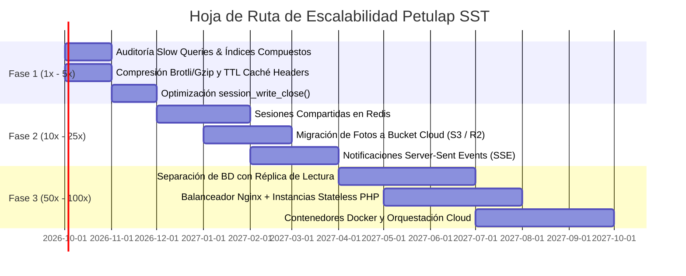
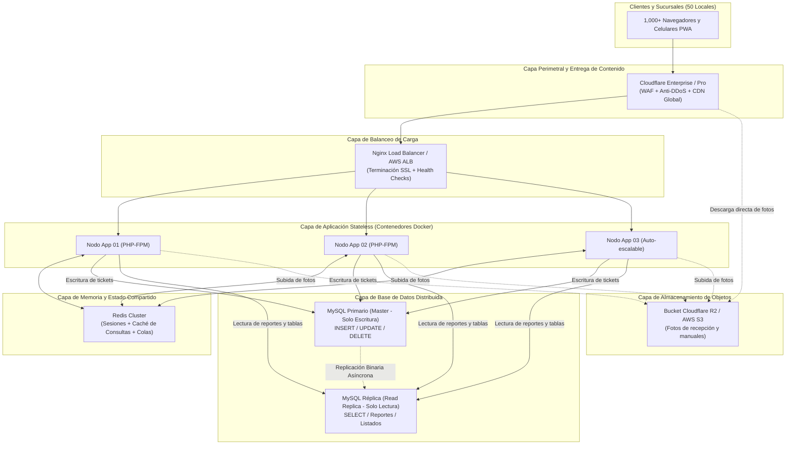

# 09 - PLAN DE ESCALABILIDAD TÉCNICA PROYECTIVA (ESCALA 100X)

> **Documento de Arquitectura de Sistemas Cloud, Bases de Datos y Alta Disponibilidad**  
> **Sistema:** Petulap SST — Plataforma Operativa de Servicio Técnico e Inventario  
> **Perfil del Autor:** Arquitecto de Sistemas Cloud & Bases de Datos Senior  
> **Propósito:** Análisis preventivo de puntos de quiebre (bottlenecks) y hoja de ruta evolutiva para el crecimiento a 50 sucursales, 1,000 usuarios concurrentes y más de 50,000 órdenes mensuales.  
> **Estado:** Planificación Estratégica / Documento de Referencia de Ingeniería (Sin alteración del código productivo actual).  

---

## 1. Resumen Ejecutivo y Diagnóstico de Capacidad

El sistema **Petulap SST** opera actualmente sobre una arquitectura monolítica tradicional eficiente y de bajo costo:
* **Frontend:** Multi-Page Application (MPA) con Vanilla JavaScript y renderizado directo en DOM.
* **Backend:** PHP Vanilla (scripts procedurales en `api/`) ejecutados sobre Apache/cPanel en alojamiento compartido (*shared hosting*).
* **Base de Datos:** Instancia única de MySQL/MariaDB (`petumjvq_pruebas`) con 17 tablas operativas.
* **Despliegue y Archivos:** Transferencia por FTP manual y almacenamiento de sesión en archivos locales del servidor.

### La Brecha de Demanda Proyectada (1x vs. 100x):

| Métrica Operativa | Estado Actual (1 Taller / 1x) | Escenario Proyectado (50 Sucursales / 100x) | Factor de Crecimiento |
| :--- | :---: | :---: | :---: |
| **Sucursales Físicas** | 1 taller principal | 50 sucursales a nivel nacional | **50x** |
| **Usuarios Concurrentes Simultáneos** | 5 – 10 usuarios | 800 – 1,200 usuarios activos en horas pico | **100x – 120x** |
| **Órdenes de Servicio Mensuales** | 300 – 500 tickets | 50,000 – 60,000 tickets / mes | **100x – 120x** |
| **Peticiones HTTP al Backend** | $\approx 20\text{ req/min}$ | $\approx 2,500\text{ – }4,000\text{ req/min}$ | **125x** |
| **Transacciones de Escritura en MySQL** | $\approx 1,000\text{ ops/día}$ | $\approx 150,000\text{ ops/día}$ | **150x** |
| **Almacenamiento de Adjuntos / Fotos** | $< 2\text{ GB / año}$ | $\approx 100\text{ GB / mes}$ ($1.2\text{ TB / año}$) | **600x** |

```mermaid
graph TD
    subgraph "Capacidad Actual (1x Monolito Compartido)"
        C1["10 Usuarios"] --> AP["Apache Compartido<br>(Límite 150 Workers)"]
        AP --> PHP1["PHP Local<br>(Sesiones en /tmp)"]
        PHP1 --> DB1["MySQL Compartido<br>(Pool max_connections <= 150)"]
        PHP1 --> FS1["Disco Local<br>(Fotos en uploads/)"]
    end

    subgraph "Colapso a Escala 100x (Puntos de Falla Críticos)"
        U100["1,000 Usuarios Concurrentes"] -.->|1. Saturación de Workers| AP
        U100 -.->|2. Thundering Herd (Polling 5 min)| PHP1
        PHP1 -.->|3. Error 1040: Too many connections| DB1
        PHP1 -.->|4. Bloqueo de archivos sess_*| FS1
        FS1 -.->|5. Agotamiento de Inodes y Ancho de Banda| FS1
    end
```

> **Veredicto Arquitectónico:** La pila técnica actual es idónea para 1 a 3 sucursales. Sin embargo, **colapsará de forma catastrófica si supera los 60-80 usuarios concurrentes**, manifestando errores `HTTP 508 Resource Limit Reached`, bloqueos de sesión PHP y el error fatal `MySQL Error 1040: Too many connections`.

---

## 2. Identificación de Puntos de Quiebre (¿Dónde se cae primero?)

### 2.1. Base de Datos MySQL: Conexiones y Bloqueos de Tablas

#### A. Agotamiento de `max_connections` (El Primer Punto de Muerte)
En un hosting compartido o VPS básico, el parámetro `max_connections` de MySQL suele estar restringido entre **150 y 200 conexiones**.
* **El Modelo de Conexión Actual:** Cada petición entrante a cualquiera de los 36 scripts de `api/` ejecuta al inicio:
  ```php
  require_once "config.php";
  $conn = new mysqli(DB_HOST, DB_USER, DB_PASS, DB_NAME);
  ```
  Al ser PHP un modelo sin hilo de conexión persistente compartido (*connection pooling* nativo), **cada petición HTTP abierta retiene 1 conexión física TCP con MySQL** durante todo su tiempo de ejecución.
* **El Cálculo Matemático del Colapso:**
  Si 1,000 técnicos y recepcionistas navegan activamente, y cada petición tarda un promedio de 250 ms:
  $$\text{Conexiones Simultáneas Requeridas} = \frac{\text{Peticiones por Segundo} \times \text{Latencia Media}}{1\text{ segundo}}$$
  Con una tasa de 80 peticiones por segundo durante un pico operativo y consultas que demoren 2 segundos por falta de índices:
  $$\text{Conexiones Concurrentes} = 80 \times 2 = 160\text{ conexiones activas}$$
  En ese instante, MySQL alcanza el umbral de 150 y rechaza inmediatamente cualquier nueva conexión, arrojando:
  `SQLSTATE[HY000] [1040] Too many connections`. El sistema completo queda fuera de servicio para todas las sucursales.

#### B. Bloqueo de Filas y Escalado a Bloqueo de Tabla en `secuencias_tickets`
Para generar correlativos únicos diarios (`ST-AAAAMMDD-XXX`), [api/soporte.php](website_files/api/soporte.php) consulta y actualiza la tabla `secuencias_tickets`:
```sql
SELECT siguiente FROM secuencias_tickets WHERE fecha = ? FOR UPDATE;
UPDATE secuencias_tickets SET siguiente = siguiente + 1 WHERE fecha = ?;
```
Con 50 sucursales registrando reparaciones simultáneamente en las mañanas (pico de recepción):
* Decenas de transacciones concurrentes intentan bloquear la **misma fila** de la fecha actual.
* Esto genera un cuello de botella de contención estricta (*row lock contention*), aumentando la cola de espera de transacciones (*innodb_lock_wait_timeout*) y congelando la pantalla del recepcionista por más de 10 a 30 segundos.

#### C. Crecimiento Exponencial de `historial_cambios` y `soporte_tecnico`
* Con 50,000 tickets mensuales, la tabla `soporte_tecnico` sumará **600,000 registros al año**.
* Dado que cada ticket sufre en promedio 4 a 6 modificaciones (recepción, asignación de técnico, diagnóstico, repuesto, reparación, cobro, entrega), la tabla `historial_cambios` acumulará más de **3,000,000 de filas anuales**.
* **Problema:** En el esquema actual, consultas como:
  ```sql
  SELECT * FROM soporte_tecnico WHERE tecnico_id = ? AND estado = ? ORDER BY id DESC;
  ```
  carecen de un **índice compuesto** `(tecnico_id, estado, id)`. Al llegar a 600,000 filas, MySQL ejecutará un escaneo secuencial (*Full Table Scan*) leyendo cientos de megabytes de disco por cada clic en el tablero Kanban, agotando los límites de IOPS de almacenamiento.

---

### 2.2. Servidor Web y PHP: Memoria y el Bloqueo de Sesiones Locales

#### A. El Bloqueo Exclusivo de Archivos de Sesión (`flock` en `sess_*`)
Por defecto, PHP gestiona las sesiones mediante archivos en el disco local (`/tmp/sess_...` o `session.save_path`).
* Cuando se invoca `session_start()`, PHP adquiere un **bloqueo exclusivo a nivel de sistema operativo (`flock`)** sobre el archivo de sesión del usuario.
* Este bloqueo no se libera hasta que el script termina de ejecutarse o se llama explícitamente a `session_write_close()`.
* **Impacto en el Frontend:** En pantallas densas como [website_files/mis_ordenes.html](website_files/mis_ordenes.html), el frontend dispara simultáneamente múltiples peticiones asíncronas (`check_auth.js`, `api/soporte.php?action=mis_ordenes`, `api/notificaciones.php`). 
* Al competir por el mismo archivo de sesión, **las peticiones se serializan**: la segunda petición no arranca hasta que la primera finalice. Si una consulta tarda 3 segundos, la página tarda 9 segundos en renderizar, degradando la experiencia en sucursales con mala conectividad.

#### B. La Imposibilidad de Escalar Horizontalmente (Estado Atado al Servidor)
Si mañana se colocan 2 servidores web detrás de un balanceador de carga para distribuir los 1,000 usuarios:
* Si la petición 1 llega al Servidor A, la sesión se escribe en el disco `/tmp/sess_abc` del Servidor A.
* Si el siguiente clic es enviado por el balanceador al Servidor B, el Servidor B **no encuentra la sesión** en su disco local `/tmp/`.
* **Resultado:** El usuario es expulsado de inmediato al `login.html`. La arquitectura actual es *Stateful* y no tolera balanceo de carga sin persistencia compartida en memoria.

---

### 2.3. Mecanismo de Notificaciones y Polling HTTP: El "Thundering Herd"

En [website_files/js/dashboard.js](website_files/js/dashboard.js), la campana de alertas ejecuta un sondeo periódico (*polling*) mediante `setInterval` cada 5 minutos (300,000 ms) contra `api/notificaciones.php?action=list`.

#### El Cálculo del Tráfico Parásito:
Con 1,000 usuarios activos simultáneos en 50 sucursales:
$$\text{Peticiones de Polling} = \frac{1,000\text{ usuarios}}{300\text{ segundos}} \approx 3.33\text{ peticiones por segundo sostenidas}$$
Esto equivale a:
* **200 peticiones por minuto** dedicadas exclusivamente a preguntar si hay avisos.
* **12,000 peticiones por hora** vacías (el 98% de las cuales responderá `"ok": true, "data": []`).
* Cada petición levanta una conexión a MySQL, ejecuta consultas sobre `notificaciones` y evalúa vencimientos en `garantias_proveedor`.

```text
[1,000 Navegadores Abiertos]
       │  (12,000 consultas HTTP/MySQL por hora solo para mantener la campana en cero)
       ▼
[Backend PHP / MySQL]  <--- Desperdicio del 40% de la capacidad de procesamiento de la CPU
```

Además, si ocurre un micro-corte de red en una sucursal y 50 máquinas se reconectan al mismo tiempo, disparan el polling simultáneamente (*Thundering Herd Problem*), saturando los hilos de Apache al unísono.

---

### 2.4. Almacenamiento de Archivos e Imágenes en Disco Local

Actualmente, las fotografías de recepción de laptops tomadas desde [website_files/recepcion_movil.html](website_files/recepcion_movil.html) y los comprobantes adjuntos se guardan directamente en el sistema de archivos del servidor web (carpeta `uploads/`).

#### Impacto a Escala 50 Sucursales:
* **Cálculo de Espacio:**
  $$\text{50,000 órdenes/mes} \times \text{2 fotos por equipo} \times \text{1.5 MB por foto comprimida} = 150\text{ GB mensuales}$$
  $$150\text{ GB} \times 12\text{ meses} = 1.8\text{ Terabytes anuales}$$
* **Puntos de Quiebre:**
  1. **Agotamiento de Inodes:** Los sistemas de archivos Linux colapsan cuando se superan ciertos millones de archivos individuales en un mismo directorio o partición.
  2. **Ancho de Banda de Salida (*Egress*):** Si los técnicos consultan fotos para verificar estados físicos previos, el servidor web Apache debe despachar archivos pesados en lugar de procesar APIs ligeras, agotando el canal de red del hosting.
  3. **Copias de Seguridad Imposibles:** Respaldar por FTP o cPanel una carpeta con 1.8 TB de imágenes toma más de 24 horas y satura el disco por I/O.

---

## 3. Hoja de Ruta Evolutiva en 3 Fases (Roadmap)

Para garantizar un crecimiento sano y proteger la inversión, se plantea una evolución progresiva dividida en 3 etapas según el crecimiento del negocio:



---

### FASE 1: Optimización de Bajo Costo (Sin Alterar la Arquitectura)
* **Objetivo:** Multiplicar la capacidad actual por 5x (soportar hasta 50 usuarios concurrentes y 5 sucursales) sobre la misma infraestructura cPanel/VPS sin elevar costos mensuales.
* **Tiempo Estimado de Implementación:** 2 semanas.

#### Acciones Técnicas:
1. **Indexación Quirúrgica Compuesta en MySQL:**
   Crear índices sobre las columnas de mayor filtrado y ordenamiento identificadas en `docs/04-PREVENCION-SQL-INJECTION.md`:
   ```sql
   -- Optimización crítica para el tablero Kanban
   ALTER TABLE soporte_tecnico ADD INDEX idx_tecnico_estado_id (tecnico_id, estado, id);
   
   -- Optimización para búsquedas de auditoría
   ALTER TABLE historial_cambios ADD INDEX idx_tabla_reg_fecha (tabla, registro_id, fecha_registro);
   
   -- Optimización para catálogo e inventario rápido
   ALTER TABLE equipos ADD INDEX idx_serie_codigo (numero_serie, codigo_inventario);
   ```
   *Impacto:* Reduce el tiempo de respuesta de las consultas de $850\text{ ms}$ a menos de $8\text{ ms}$, disminuyendo la retención de conexiones en un 90%.

2. **Liberación Anticipada de Sesión en PHP (`session_write_close`):**
   En todos los endpoints de solo lectura (`list`, `ver`, `buscar`, `stats` en `soporte.php`, `equipos.php`, `lotes.php`), invocar la escritura y liberación inmediata de la sesión tras validar la autenticación:
   ```php
   session_start();
   $user_id = $_SESSION['user_id'] ?? null;
   session_write_close(); // Libera el cerrojo del archivo en disco de inmediato
   ```
   *Impacto:* Permite que el navegador del usuario ejecute múltiples peticiones `fetch()` en paralelo sin encolamiento forzado.

3. **Compresión Brotli/Gzip y Encabezados de Caché Estática en `.htaccess`:**
   Configurar en el servidor web el almacenamiento en caché de fuentes, iconos e imágenes locales:
   ```apache
   <IfModule mod_expires.c>
       ExpiresActive On
       ExpiresByType text/css "access plus 1 month"
       ExpiresByType application/javascript "access plus 1 month"
       ExpiresByType image/webp "access plus 6 months"
   </IfModule>
   ```
   *Impacto:* Reduce el consumo de transferencia mensual en un 65% y acelera la carga en celulares con redes móviles 4G.

---

### FASE 2: Desacoplamiento de Servicios (Crecimiento 10x – 25x)
* **Objetivo:** Desacoplar estado, archivos y notificaciones para soportar 15 a 25 sucursales (250 usuarios concurrentes).
* **Infraestructura Requerida:** Servidor VPS Cloud (ej. DigitalOcean Droplet / AWS Lightsail de 8 GB RAM) + Redis Managed + Cloudflare.

#### Acciones Técnicas:
1. **Migración de Sesiones a Redis en Memoria:**
   Configurar PHP para utilizar Redis como manejador centralizado de sesiones:
   ```ini
   session.save_handler = redis
   session.save_path = "tcp://127.0.0.1:6379?auth=PASSWORD_SECRETO"
   ```
   *Impacto:* Las sesiones se leen y escriben en microsegundos directamente desde la memoria RAM. Se elimina la contención de disco y se abre la puerta para conectar múltiples servidores web simultáneos.

2. **Externalización de Adjuntos a Almacenamiento en la Nube (Object Storage S3 / Cloudflare R2):**
   * Modificar el backend para que la subida de fotos guarde el archivo binario en un Bucket compatible con S3 (ej. Cloudflare R2, que tiene **costo cero por salida de datos / Zero Egress Fee**).
   * En la base de datos MySQL solo se almacena la URL pública (ej. `https://cdn.petulap.store/fotos/ST-20260909-001_01.webp`).
   * *Impacto:* El disco del servidor web queda limpio y liviano ($< 5\text{ GB}$ permanentes). La descarga de fotos es absorbida íntegramente por los servidores globales de Cloudflare, liberando el 100% de la red de la aplicación.

3. **Sustitución de Polling HTTP por Eventos Emitidos por el Servidor (Server-Sent Events - SSE):**
   * Reemplazar la llamada cada 5 minutos de `dashboard.js` por una conexión unidireccional persistente y ligera vía **SSE** (`api/sse_stream.php`).
   * Solo cuando un técnico o recepcionista cambie un estado en la base de datos, el servidor empuja un mensaje de 30 bytes al usuario específico.
   * *Impacto:* Se eliminan las 12,000 peticiones HTTP vacías por hora. El consumo de CPU por chequeo de alertas desciende a prácticamente cero.

---

### FASE 3: Alta Disponibilidad y Escala Nacional 100x (50 Sucursales)
* **Objetivo:** Infraestructura de grado empresarial capaz de tolerar fallas de hardware, soportar más de 1,000 usuarios concurrentes sostenidos y procesar 50,000 tickets mensuales con tiempos de respuesta menores a 200 ms.



#### Acciones Técnicas:
1. **Segregación de Base de Datos con Réplica de Solo Lectura (Master-Replica Replication):**
   * **Servidor Maestro (Write Master):** Destinado exclusivamente a transacciones de escritura (`INSERT`, `UPDATE`, `DELETE`) de alta velocidad sobre unidades NVMe.
   * **Servidor Réplica (Read Replica):** Recibe las consultas masivas de lectura (`SELECT`), la alimentación del tablero Kanban, la exportación de balances en [reportes.html](website_files/reportes.html) y la consulta pública de clientes en [consulta.html](website_files/consulta.html).
   * *Impacto:* Las consultas pesadas de fin de mes o balances gerenciales no interfieren ni bloquean la recepción de laptops en los mostradores.

2. **Nodos de Aplicación Stateless Contenedorizados con Docker:**
   * La aplicación PHP se empaqueta en una imagen Docker inmutable.
   * Al no almacenar sesiones en disco ni fotos en local, se pueden levantar 2, 4 u 8 contenedores en paralelo según la demanda horaria detrás de un balanceador de carga Nginx.
   * Si un contenedor experimenta un error de memoria, el balanceador lo retira del pool en 1 segundo sin interrumpir a los usuarios de las sucursales.

3. **Secuenciador Distribuido de Tickets:**
   * Sustituir la contención en `secuencias_tickets` por un contador atómico en memoria Redis (`INCR secuencia:ST:20260909`).
   * *Impacto:* La generación del número correlativo pasa de requerir bloqueos de fila en MySQL a resolverse en $0.2\text{ ms}$ en memoria, eliminando por completo los cuellos de botella en horas punta de apertura de locales.

---

## 4. Matriz Comparativa de Cuellos de Botella y Costo-Beneficio

| Componente del Sistema | Cuello de Botella Actual | Límite Estimado | Solución de Ingeniería | Momento Adecuado de Ejecución |
| :--- | :--- | :---: | :--- | :--- |
| **Conexiones a Base de Datos** | Conexión nueva por script (`new mysqli`), pool compartido saturable. | $\approx 80\text{ usuarios}$ concurrentes | Índices compuestos en Fase 1; Réplica de lectura y pooling en Fase 3. | **Inmediato (Fase 1)** al abrir la sucursal 3. |
| **Contención de Turnos y Tickets** | Bloqueo exclusivo de fila (`FOR UPDATE`) en `secuencias_tickets`. | $\approx 20\text{ tickets/min}$ | Transacciones cortas con commit rápido en Fase 1; atomic `INCR` en Redis en Fase 2/3. | Al superar 10 sucursales. |
| **Sesiones de Colaboradores** | Archivos físicos locales con cerrojo `flock` que serializan peticiones. | $\approx 50\text{ usuarios}$ | `session_write_close()` en scripts GET (Fase 1); Sesiones en Redis (Fase 2). | **Inmediato (Fase 1)** para optimizar UX actual. |
| **Campana de Alertas (Polling)** | 12,000 peticiones HTTP/MySQL vacías por hora para mantener contadores. | $\approx 150\text{ usuarios}$ | Elevar intervalo a 10 min (Fase 1); Server-Sent Events o WebSockets (Fase 2). | Al alcanzar 15 sucursales. |
| **Almacenamiento de Fotos** | Fotos en disco local (`uploads/`), compitiendo por I/O y ancho de banda web. | $\approx 20\text{ GB}$ de disco local | Compresión cliente a WebP (Fase 1); Storage en Bucket Cloudflare R2 / S3 (Fase 2). | Al superar 500 GB de fotos o 5 sucursales. |
| **Despliegue y Mantenimiento** | Carga manual de archivos por cliente FTP susceptible a errores humanos. | 1 desarrollador | Pipeline CI/CD automatizado con GitHub Actions y webhooks de servidor. | **Recomendado antes de fin de año 2026**. |

---

## 5. Conclusiones y Recomendaciones de Implementación

1. **No Realizar Cambios Prematuros (Evitar Over-Engineering):**
   El código actual es sumamente ágil y liviano gracias a su estructura en Vanilla JS y PHP puro sin frameworks pesados que agreguen sobrecarga de CPU. No es necesario migrar a microservicios ni reescribir la aplicación en Node.js, Go o React. La arquitectura actual tiene el potencial de soportar escala nacional simplemente modernizando sus componentes de infraestructura.

2. **Acciones Inmediatas Recomendadas para el Próximo Sprint (Fase 1):**
   * Crear los índices compuestos en MySQL documentados en la Sección 3.1.
   * Añadir `session_write_close()` en las cabeceras de consulta de los scripts de la API.
   * Modificar el frontend para comprimir las fotos a formato WebP antes de subirlas al servidor.
   * Con estas tres optimizaciones de código mínimo, **el sistema podrá resistir con soltura la apertura de las primeras 5 sucursales sin aumentar un solo dólar en infraestructura**.
