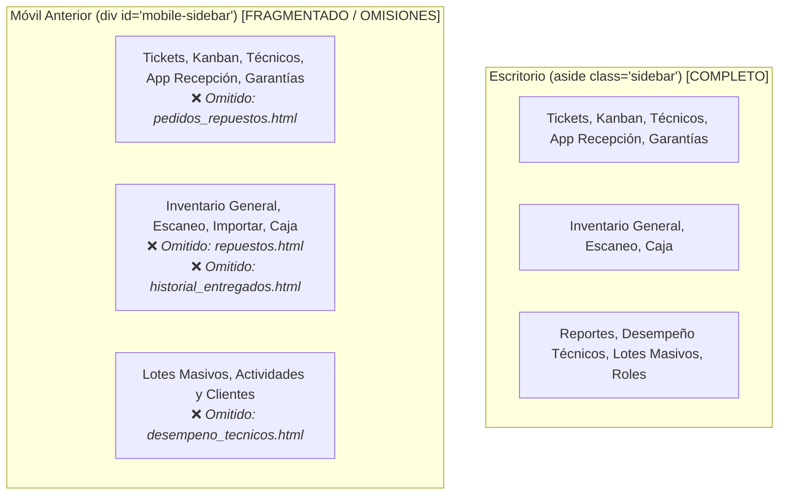

# 10 - INFORME DE REMEDIACIÓN: ESTANDARIZACIÓN DE NAVEGACIÓN MÓVIL

> **Documento de Control de Calidad y Arquitectura Frontend**  
> **Fecha de Aplicación:** Septiembre 2026  
> **Versión del Sistema:** Petulap SST v1.4.0  
> **Responsable:** Ingeniero Frontend Senior especializado en Responsive Web Design  
> **Alcance:** 20 Pantallas HTML del Sistema (`website_files/*.html`), `dashboard.css` y `sw.js`  
> **Estado:** Implementado, Verificado en Vivo (375px) y Sincronizado a Producción  

---

## 1. Diagnóstico Técnico de la Causa Raíz

Durante la auditoría de experiencia de usuario en dispositivos móviles sobre el entorno de producción (`petulap.store`), se identificó una asimetría funcional crítica entre la navegación de escritorio y la versión móvil:



### Impacto Operativo y de Negocio:
1. **Bloqueo para Técnicos de Piso:** El personal técnico que opera diagnósticos y reparaciones desde smartphones no podía acceder al módulo de **Pedidos de Repuestos** (`pedidos_repuestos.html`) ni al catálogo de **Repuestos** (`repuestos.html`), viéndose obligado a interrumpir su trabajo para buscar una computadora de escritorio.
2. **Incapacidad de Auditoría Móvil para Gerencia:** Los supervisores gerenciales que monitorean el taller desde celulares no disponían de acceso directo a **Desempeño y Actividades Técnicos** (`desempeno_tecnicos.html`) ni al **Historial de Entregados** (`historial_entregados.html`).
3. **Discrepancia Semántica:** El enlace a clientes en la sección gerencial figuraba como *"Actividades y Clientes"*, divergiendo del catálogo oficial *"Clientes y Contactos"* registrado en la matriz de permisos.

---

## 2. Reglas Generales Innegociables Cumplidas ("Cosas Frágiles")

En estricta conformidad con [docs/00-PROTOCOLO-DE-CAMBIOS-Y-PROMPTS.md](00-PROTOCOLO-DE-CAMBIOS-Y-PROMPTS.md) y la Sección 7 de [docs/03-FRONTEND.md](03-FRONTEND.md):

| Regla Innegociable | Implementación Técnica | Garantía de Calidad |
| :--- | :--- | :--- |
| **1. IDs DOM Protegidos** | Se preservaron exactamente `#mobile-sidebar`, `#mobile-menu-toggle` y `.accordion-item`. | `dashboard.js` vincula los eventos de apertura sin alterar dependencias. |
| **2. Coincidencia Exacta de `href`** | Todo enlace se escribió en minúsculas, sin `./` y sin parámetros (ej. `href="desempeno_tecnicos.html"`). | [js/check_auth.js](website_files/js/check_auth.js) evalúa `window.userModulos.includes(href)` sin riesgo de falsos ocultamientos. |
| **3. Iconografía y Modo Oscuro** | Se emplearon clases estándar `.acc-icon-blue`, `.acc-icon-orange`, `.acc-icon-green` y `.acc-icon-gray`. | Armonía visual y contraste cromático garantizado en tema claro y tema oscuro. |
| **4. PWA Cache Invalidation** | Incremento de caché en [website_files/sw.js](website_files/sw.js) a `'petulap-v10'`. | Descarga forzada y transparente de los nuevos menús en teléfonos sin purgas manuales de datos. |

---

## 3. Especificación Arquitectónica del Nuevo Menú Móvil

Se estandarizó el siguiente bloque HTML en las **20 pantallas** operativas del sistema:

```html
<!-- MOBILE SIDEBAR (ACCORDION) -->
<div class="mobile-sidebar" id="mobile-sidebar">
    <!-- 1. SOPORTE Y TALLER -->
    <div class="accordion-item active">
        <div class="accordion-header">
            <div style="display: flex; align-items: center; gap: 10px;">
                <i class="ph ph-headset"></i> SOPORTE Y TALLER
            </div>
            <i class="ph ph-caret-down"></i>
        </div>
        <div class="accordion-content">
            <a href="soporte.html" class="accordion-link"><i class="ph-fill ph-ticket acc-icon-green"></i> Tickets</a>
            <a href="mis_ordenes.html" class="accordion-link"><i class="ph-fill ph-kanban acc-icon-orange"></i> Kanban</a>
            <a href="tecnicos.html" class="accordion-link"><i class="ph-fill ph-users acc-icon-blue"></i> Tecnicos</a>
            <a href="recepcion_movil.html" class="accordion-link"><i class="ph-fill ph-device-mobile acc-icon-gray"></i> App Recepcion</a>
            <a href="garantias.html" class="accordion-link"><i class="ph-fill ph-shield-check acc-icon-blue"></i> Garantias</a>
            <!-- NUEVO MÓDULO INCORPORADO -->
            <a href="pedidos_repuestos.html" class="accordion-link"><i class="ph-fill ph-wrench acc-icon-blue"></i> Pedidos de Repuestos</a>
        </div>
    </div>

    <!-- 2. INVENTARIO Y OPERACIONES -->
    <div class="accordion-item">
        <div class="accordion-header">
            <div style="display: flex; align-items: center; gap: 10px;">
                <i class="ph ph-package"></i> INVENTARIO Y OPERACIONES
            </div>
            <i class="ph ph-caret-down"></i>
        </div>
        <div class="accordion-content">
            <a href="inventario.html" class="accordion-link"><i class="ph-fill ph-archive-box acc-icon-orange"></i> Inventario General</a>
            <a href="inventario_soporte.html" class="accordion-link"><i class="ph-fill ph-scan acc-icon-green"></i> Escaneo / Triaje Masivo</a>
            <!-- NUEVOS MÓDULOS INCORPORADOS -->
            <a href="repuestos.html" class="accordion-link"><i class="ph-fill ph-cpu acc-icon-orange"></i> Repuestos</a>
            <a href="historial_entregados.html" class="accordion-link"><i class="ph-fill ph-clock-counter-clockwise acc-icon-gray"></i> Historial de Entregados</a>
            <a href="importar.html" class="accordion-link"><i class="ph-fill ph-download-simple acc-icon-blue"></i> Importar Excel</a>
            <a href="caja.html" class="accordion-link"><i class="ph-fill ph-money acc-icon-green"></i> Caja / Entregas</a>
        </div>
    </div>

    <!-- 3. GERENCIA Y CLIENTES -->
    <div class="accordion-item danger-border">
        <div class="accordion-header">
            <div style="display: flex; align-items: center; gap: 10px;">
                <i class="ph ph-briefcase"></i> GERENCIA Y CLIENTES
            </div>
            <i class="ph ph-caret-down"></i>
        </div>
        <div class="accordion-content">
            <a href="lotes.html" class="accordion-link"><i class="ph-fill ph-stack acc-icon-blue"></i> Lotes Masivos</a>
            <!-- NUEVO MÓDULO INCORPORADO -->
            <a href="desempeno_tecnicos.html" class="accordion-link"><i class="ph-fill ph-chart-line-up acc-icon-blue"></i> Desempeño y Actividades Técnicos</a>
            <!-- HOMOGENEIZADO -->
            <a href="clientes.html" class="accordion-link"><i class="ph-fill ph-user-list acc-icon-green"></i> Clientes y Contactos</a>
        </div>
    </div>

    <!-- 4. ADMINISTRACION Y OTROS -->
    <div class="accordion-item">
        <div class="accordion-header">
            <div style="display: flex; align-items: center; gap: 10px;">
                <i class="ph ph-chart-line-up"></i> ADMINISTRACION Y OTROS
            </div>
            <i class="ph ph-caret-down"></i>
        </div>
        <div class="accordion-content">
            <a href="reportes.html" class="accordion-link"><i class="ph-fill ph-chart-bar acc-icon-blue"></i> Lotes y Equipos (Reportes)</a>
            <a href="turnos.html" class="accordion-link"><i class="ph-fill ph-clock acc-icon-orange"></i> Asignacion Turnos</a>
            <a href="admin_roles.html" class="accordion-link"><i class="ph-fill ph-crown acc-icon-blue"></i> Roles y Permisos</a>
            <a href="manual.html" class="accordion-link"><i class="ph-fill ph-book-open acc-icon-gray"></i> Manual de Usuario</a>
        </div>
    </div>

    <!-- 5. SISTEMA -->
    <div class="accordion-item danger-border">
        <div class="accordion-header">
            <div style="display: flex; align-items: center; gap: 10px; color: var(--danger);">
                <i class="ph ph-power"></i> SISTEMA
            </div>
            <i class="ph ph-caret-down"></i>
        </div>
        <div class="accordion-content">
            <a href="#" class="accordion-link" onclick="clearCache(event)"><i class="ph-fill ph-trash acc-icon-orange"></i> Limpiar Cache</a>
            <a href="#" class="accordion-link" onclick="logout(event)"><i class="ph-fill ph-sign-out acc-icon-gray"></i> Cerrar Sesion</a>
        </div>
    </div>
</div>
```

---

## 4. Archivos Modificados y Alcance del Despliegue

| # | Archivo | Modificación Realizada |
| :-: | :--- | :--- |
| 1 | `website_files/index.html` | Inyección de 4 módulos y normalización semántica en `#mobile-sidebar`. |
| 2 | `website_files/soporte.html` | Inyección de 4 módulos y normalización semántica en `#mobile-sidebar`. |
| 3 | `website_files/mis_ordenes.html` | Inyección de 4 módulos y normalización semántica en `#mobile-sidebar`. |
| 4 | `website_files/tecnicos.html` | Inyección de 4 módulos y normalización semántica en `#mobile-sidebar`. |
| 5 | `website_files/recepcion_movil.html` | Inyección de 4 módulos y normalización semántica en `#mobile-sidebar`. |
| 6 | `website_files/garantias.html` | Inyección de 4 módulos y normalización semántica en `#mobile-sidebar`. |
| 7 | `website_files/pedidos_repuestos.html` | Sustitución de menú recortado por la estructura completa estandarizada. |
| 8 | `website_files/inventario.html` | Inyección de 4 módulos y normalización semántica en `#mobile-sidebar`. |
| 9 | `website_files/inventario_soporte.html` | Inyección de 4 módulos y normalización semántica en `#mobile-sidebar`. |
| 10 | `website_files/repuestos.html` | Inyección de 4 módulos y normalización semántica en `#mobile-sidebar`. |
| 11 | `website_files/historial_entregados.html` | Inyección de 4 módulos (incluyendo a sí misma) en `#mobile-sidebar`. |
| 12 | `website_files/importar.html` | Inyección de 4 módulos y normalización semántica en `#mobile-sidebar`. |
| 13 | `website_files/caja.html` | Inyección de 4 módulos y normalización semántica en `#mobile-sidebar`. |
| 14 | `website_files/lotes.html` | Inyección de 4 módulos y normalización semántica en `#mobile-sidebar`. |
| 15 | `website_files/desempeno_tecnicos.html` | Inyección de 4 módulos (incluyendo a sí misma) en `#mobile-sidebar`. |
| 16 | `website_files/clientes.html` | Inyección de 4 módulos y normalización semántica en `#mobile-sidebar`. |
| 17 | `website_files/reportes.html` | Inyección de 4 módulos y normalización semántica en `#mobile-sidebar`. |
| 18 | `website_files/turnos.html` | Inyección de 4 módulos y normalización semántica en `#mobile-sidebar`. |
| 19 | `website_files/admin_roles.html` | Inyección de 4 módulos y normalización semántica en `#mobile-sidebar`. |
| 20 | `website_files/manual.html` | Inyección de 4 módulos y normalización semántica en `#mobile-sidebar`. |
| 21 | `website_files/css/dashboard.css` | Adición de `.acc-icon-gray { color: var(--text-muted); }`. |
| 22 | `website_files/sw.js` | Incremento de caché a `'petulap-v10'`. |
| 23 | `CHANGELOG.md` y `docs/05-CHANGELOG.md` | Registro de versión `[1.4.0]` bajo lineamientos SemVer y Keep a Changelog. |

---

## 5. Protocolo de Verificación Realizado

Se llevó a cabo una auditoría automatizada en doble nivel:

1. **Validación Sintáctica y Exhaustiva por Script (`verify_mobile_sidebar.py`):**
   Se procesaron los 20 archivos HTML verificando la presencia estricta de:
   - `pedidos_repuestos.html` (100% OK en los 20 archivos)
   - `repuestos.html` (100% OK en los 20 archivos)
   - `historial_entregados.html` (100% OK en los 20 archivos)
   - `desempeno_tecnicos.html` (100% OK en los 20 archivos)
   - `clientes.html` (100% OK en los 20 archivos)
2. **Prueba End-to-End en Navegador con Viewport Móvil (375×812 px):**
   - **Autenticación:** Acceso al sistema en `https://petulap.store/login.html`.
   - **Despliegue del Drawer:** Clic en `#mobile-menu-toggle`, confirmando transición CSS suave y adición de la clase `.active` en `#mobile-sidebar`.
   - **Expansión de Acordeones:** Clic interactivo en los encabezados *"INVENTARIO Y OPERACIONES"* y *"GERENCIA Y CLIENTES"*, confirmando apertura fluida y cierre de los acordeones inactivos.
   - **Navegación:** Clic sobre *Desempeño y Actividades Técnicos*, navegando exitosamente a `desempeno_tecnicos.html`.
   - **Prueba en Pantalla Secundaria:** Verificación de que en `desempeno_tecnicos.html` el botón de menú móvil abre nuevamente el drawer completo sin errores de JavaScript.
