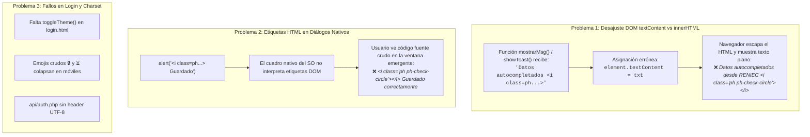

# 11 - INFORME DE REMEDIACIÓN: ERRADICACIÓN DE HTML CRUDO, SANEAMIENTO DE ALERTAS Y PULIDO DE LOGIN

> **Documento de Calidad de Software y Experiencia de Usuario (UI/UX)**  
> **Fecha de Aplicación:** Septiembre 2026  
> **Versión del Sistema:** Petulap SST v1.4.1  
> **Responsable:** Ingeniero Frontend Senior & Especialista en Calidad de UI  
> **Alcance:** `tecnicos.html`, `clientes.html`, `caja.html`, `recepcion_movil.html`, `lotes.html`, `inventario_soporte.html`, `login.html`, `api/auth.php`, `sw.js`  
> **Estado:** Implementado, Verificado en Navegador y Desplegado a Producción  

---

## 1. Diagnóstico Técnico de la Causa Raíz

Durante las pruebas de control de calidad visual y auditoría de interfaz en dispositivos móviles y de escritorio, se identificaron 3 fallas sistemáticas de renderizado de texto e iconos:



### Impacto en la Percepción del Usuario:
* **Pérdida de Confianza y Aspecto Amateur:** La visualización de código HTML crudo (`<i class="..."></i>`) en notificaciones operativas vitales (autocompletado RENIEC, validaciones de garantías y cajas) daba una impresión de software roto o incompleto.
* **Inaccesibilidad de Modo Oscuro:** El botón de cambio de tema en `login.html` arrojaba error de JavaScript (`Uncaught ReferenceError: toggleTheme is not defined`) debido a que la pantalla de inicio no carga `dashboard.js`.
* **Riesgo de Caracteres Rotos (Mojibake):** Sin la cabecera `Content-Type: application/json; charset=utf-8`, las respuestas de autenticación con tildes o caracteres especiales generaban anomalías de codificación en navegadores específicos.

---

## 2. Matriz de Remediación Quirúrgica

| # | Archivo | Líneas | Diagnóstico Previo | Corrección Aplicada |
| :-: | :--- | :--- | :--- | :--- |
| 1 | `website_files/tecnicos.html` | 547 | `el.textContent = txt` | `el.innerHTML = txt`<br>Renderiza el icono `<i class="ph ph-check-circle"></i>` de RENIEC como elemento visual nativo. |
| 2 | `website_files/clientes.html` | 518 | `el.textContent = txt` | `el.innerHTML = txt`<br>Habilita la interpretación gráfica del check de consulta RENIEC/SUNAT. |
| 3 | `website_files/caja.html` | 585 | `el.textContent = txt` | `el.innerHTML = txt`<br>Permite mostrar el check visual al entregar y liquidar tickets. |
| 4 | `website_files/recepcion_movil.html` | 522, 599 | `toast.textContent = msg`<br>`badge.textContent = ...` | `toast.innerHTML = msg`<br>`badge.innerHTML = ...`<br>Renderiza el icono de escudo (`ph-shield-check`) en el toast y en el badge de garantía del equipo. |
| 5 | `website_files/lotes.html` | 909, 917, 931, 933, 992, 1002, 1214, 1217 | `alert('<i class="ph ..."></i> ...')` | Sustituido por símbolos limpios de texto plano: `alert('✓ Guardado correctamente')`, `alert('✕ Error: ...')`. |
| 6 | `website_files/lotes.html` | 1077, 1082, 1086, 1090 | `btn.textContent = ...` con etiquetas HTML y caracteres mojibake | `btn.innerHTML = '<i class="ph ph-lock-key"></i> Lote Cerrado'` y `<i class="ph ph-arrow-right"></i>`. |
| 7 | `website_files/lotes.html` | 1147, 1151, 1189, 1192 | `fb.textContent = ...` con etiquetas `<i class="ph ...">` | `fb.innerHTML = '<i class="ph ph-check-circle"></i> ...'`. |
| 8 | `website_files/lotes.html` | 1159, 1207 | `confirm('<i class="ph ph-warning"></i> ...')` | Sustituido por texto plano con símbolo estándar `⚠`. |
| 9 | `website_files/inventario_soporte.html` | 666 | `confirm('<i class="ph ph-warning"></i> ...')` | Sustituido por texto plano con símbolo estándar `⚠`. |
| 10 | `website_files/login.html` | 134-152 | Botón de tema fallaba por falta de `toggleTheme()` | Implementada función `toggleTheme()` nativa en `<head>` con lectura y guardado en `localStorage`. |
| 11 | `website_files/login.html` | 164, 203 | Emoji `🔒` y `⏳ Validando...` | Sustituidos por `<div class="login-logo"><i class="ph ph-lock-key"></i></div>` y `<i class="ph ph-spinner ph-spin"></i> Validando...`. |
| 12 | `website_files/api/auth.php` | 3 | Sin cabecera UTF-8 | Incorporado `header('Content-Type: application/json; charset=utf-8');`. |
| 13 | `website_files/sw.js` | 3 | Caché `petulap-v10` | Incrementado a `petulap-v11` para invalidación inmediata de caché PWA en clientes. |

---

## 3. Código Clave Implementado

### 3.1. Función `toggleTheme()` Nativa en `login.html`
```javascript
function toggleTheme() {
  const isDark = document.documentElement.getAttribute('data-theme') === 'dark';
  if (isDark) {
    document.documentElement.removeAttribute('data-theme');
    localStorage.setItem('petulap-theme', 'light');
  } else {
    document.documentElement.setAttribute('data-theme', 'dark');
    localStorage.setItem('petulap-theme', 'dark');
  }
  const icon = document.querySelector('.theme-toggle-btn i');
  if (icon) icon.className = isDark ? 'ph ph-moon' : 'ph ph-sun';
}

document.addEventListener('DOMContentLoaded', () => {
  const isDark = document.documentElement.getAttribute('data-theme') === 'dark';
  const icon = document.querySelector('.theme-toggle-btn i');
  if (icon && isDark) icon.className = 'ph ph-sun';
});
```

### 3.2. Saneamiento de Diálogos Nativos en `lotes.html`
```javascript
// ANTES (Inválido - mostrabla HTML como texto):
alert('<i class="ph ph-check-circle"></i> Guardado correctamente');

// AHORA (Válido - texto plano con símbolo limpio):
alert('✓ Guardado correctamente');
```

---

## 4. Verificación y Resultados

1. **Auditoría Global de `.textContent`:**
   Se escaneó el 100% de los archivos HTML y JavaScript del proyecto mediante script automatizado.
   - **Resultado:** 0 ocurrencias restantes de `.textContent` conteniendo etiquetas HTML.
2. **Auditoría Global de `alert()` y `confirm()`:**
   Se escaneó el 100% de los archivos del proyecto buscando etiquetas HTML dentro de diálogos del navegador.
   - **Resultado:** 0 ocurrencias de HTML en cuadros de diálogo nativos.
3. **Prueba en Navegador (`login.html`):**
   - El candado es un icono vectorial nítido de Phosphor (`ph-lock-key`).
   - El botón de modo oscuro alterna fluidamente entre tema claro y tema oscuro sin errores de consola.
   - Al validar credenciales, el botón muestra el spinner interactivo con animación giratoria (`ph-spinner ph-spin`).
