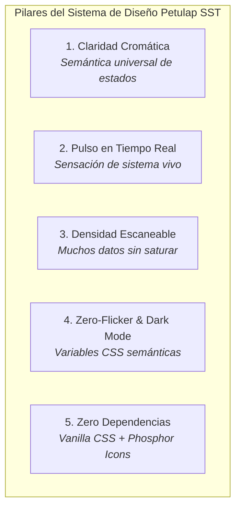
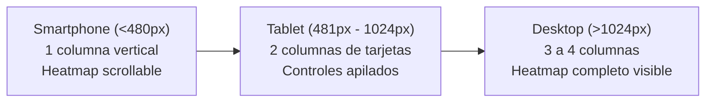

# 12 - SISTEMA DE DISEÑO UI/UX: ESTÁNDAR VISUAL EJECUTIVO SAAS Y COMPONENTES EN TIEMPO REAL

> **Documento Maestro de Diseño de Interfaz y Experiencia de Usuario (UI/UX)**  
> **Sistema:** Petulap SST  
> **Referencia de Origen:** Implementación validada en `desempeno_tecnicos.html` (Versión 1.4.3 / Caché `petulap-v13`)  
> **Destinatario:** Diseñadores, Desarrolladores Frontend y Agentes de IA (Antigravity)  
> **Objetivo:** Estandarizar y replicar la estética visual premium de monitoreo ejecutivo, mapas de calor y tarjetas interactivas en todo el ecosistema de pantallas de la plataforma.

---

## 1. Filosofía de Diseño y Principios Rectores

El rediseño de alto impacto validado en la pantalla de rendimiento técnico establece el nuevo listón estético y funcional para Petulap SST. Este lenguaje visual combina la densidad informativa de herramientas SaaS de clase mundial (estilo GitHub, Datadog y Linear) con una usabilidad inmediata para personal técnico y gerencial.



### Principios Fundamentales:
1. **Sensación de "Sistema Vivo":** El software no debe parecer una base de datos estática; debe comunicar presencia y dinamismo mediante micro-animaciones continuas (`pulse-dot`), insignias de estado vivas y cronologías visuales de progreso.
2. **Escaneo en 3 Segundos:** Un supervisor o técnico debe ser capaz de evaluar la carga, actividad y cuellos de botella con solo dar un vistazo general a la pantalla, sin necesidad de abrir menús o tablas extensas.
3. **Contraste y Respeto al Modo Oscuro:** Todos los colores, fondos, tarjetas y bordes consumen variables semánticas (`var(--...)`). En modo oscuro, los colores conservan su legibilidad sin quemar la vista ni generar fondos blancos accidentales.
4. **Independencia Tecnológica:** Se descarta el uso de frameworks pesados como Tailwind, Bootstrap o Chart.js para estas vistas; todo está construido con **CSS Grid nativo, Flexbox y animaciones por hardware**.

---

## 2. Paleta de Tokens y Variables Semánticas (`tokens.css`)

Todo componente nuevo debe enlazarse estrictamente a las variables raíz del sistema. Queda terminantemente prohibido utilizar colores hexadecimales fijos (`#ffffff`, `#000000`) directamente en el CSS de los componentes para fondos o textos.

### 2.1. Tokens de Superficie y Texto

| Variable CSS | Propósito en Modo Claro | Comportamiento en Modo Oscuro |
| :--- | :--- | :--- |
| `var(--bg-body)` | Fondo general de la página (`#F8FAFC`) | Fondo profundo de lienzo (`#0B0F17`) |
| `var(--bg-surface)` | Paneles, barras de filtros y contenedores | Superficie elevada con leve tono azulado (`#111827`) |
| `var(--bg-card)` | Tarjetas individuales y celdas | Fondo de tarjeta para contraste suave (`#1E293B`) |
| `var(--border-default)` | Líneas divisorias y bordes sutiles | Borde atenuado translúcido (`rgba(255,255,255,0.08)`) |
| `var(--text-primary)` | Títulos, nombres de técnicos y valores KPI | Blanco perlado de máximo contraste (`#F1F5F9`) |
| `var(--text-secondary)` | Subtítulos, etiquetas y roles | Gris neutro legible (`#94A3B8`) |
| `var(--text-muted)` | Textos secundarios, horas y notas al pie | Gris tenue para jerarquía baja (`#64748B`) |

### 2.2. Paleta Semántica de Estados Operativos (Live Status)

Para representar estados de actividad humana, avance de tickets o condiciones de inventario, se emplea la siguiente matriz de cuatro colores con fondos translúcidos al 12% y bordes al 28%:

| Estado Operativo | Tono Principal | Fondo Translúcido (12%) | Borde Acentuado (28%) | Significado en el Sistema |
| :--- | :--- | :--- | :--- | :--- |
| **🟢 Activo / Trabajando** | `#10B981` (Emerald) | `rgba(16, 185, 129, 0.12)` | `rgba(16, 185, 129, 0.28)` | Técnico en reparación, ticket en curso, laptop operativa, caja abierta. |
| **🟡 En Espera / Pausa** | `#F59E0B` (Amber) | `rgba(245, 158, 11, 0.12)` | `rgba(245, 158, 11, 0.28)` | Técnico en break, ticket esperando repuesto, triaje pendiente. |
| **⚪ Inactivo / Fuera** | `#64748B` (Slate) | `rgba(100, 116, 139, 0.12)` | `rgba(100, 116, 139, 0.20)` | Turno no iniciado, desconectado, equipo archivado, orden entregada. |
| **🔴 Crítico / Alerta** | `#EF4444` (Rose/Red) | `rgba(239, 68, 68, 0.12)` | `rgba(239, 68, 68, 0.28)` | Ticket vencido o en garantía, stock agotado, error de caja. |

---

## 3. Catálogo de Componentes de Interfaz

A continuación se documentan los 8 componentes clave creados en el rediseño de desempeño, con sus estructuras HTML exactas y clases CSS canónicas.

---

### 3.1. Indicadores de Pulso en Tiempo Real (`.pulse-dot`)

Un punto luminoso con animación de onda expansiva infinita que indica que el proceso, técnico o canal está activo en este momento.

```html
<!-- Variante Verde (Trabajando / Online) -->
<span class="pulse-dot pulse-green"></span>

<!-- Variante Ámbar (En Espera / Alerta) -->
<span class="pulse-dot pulse-amber"></span>

<!-- Variante Gris (Desconectado) -->
<span class="pulse-dot pulse-slate"></span>
```

```css
.pulse-dot {
    width: 9px;
    height: 9px;
    border-radius: 50%;
    display: inline-block;
    flex-shrink: 0;
}

.pulse-green {
    background: #10B981;
    box-shadow: 0 0 0 0 rgba(16, 185, 129, 0.7);
    animation: pulse-green 1.8s infinite;
}

.pulse-amber {
    background: #F59E0B;
    box-shadow: 0 0 0 0 rgba(245, 158, 11, 0.7);
    animation: pulse-amber 1.8s infinite;
}

.pulse-slate {
    background: #94A3B8;
}

@keyframes pulse-green {
    0% { transform: scale(0.95); box-shadow: 0 0 0 0 rgba(16, 185, 129, 0.7); }
    70% { transform: scale(1); box-shadow: 0 0 0 6px rgba(16, 185, 129, 0); }
    100% { transform: scale(0.95); box-shadow: 0 0 0 0 rgba(16, 185, 129, 0); }
}

@keyframes pulse-amber {
    0% { transform: scale(0.95); box-shadow: 0 0 0 0 rgba(245, 158, 11, 0.7); }
    70% { transform: scale(1); box-shadow: 0 0 0 6px rgba(245, 158, 11, 0); }
    100% { transform: scale(0.95); box-shadow: 0 0 0 0 rgba(245, 158, 11, 0); }
}
```

---

### 3.2. Insignias de Estado Vivo (`.live-chip`)

Cápsulas compactas con bordes suaves que acompañan títulos o tarjetas, combinando el punto de pulso o un ícono con una tipografía seminegrita.

```html
<span class="live-chip chip-working">
    <span class="pulse-dot pulse-green"></span> Trabajando
</span>

<span class="live-chip chip-waiting">
    <i class="ph ph-clock"></i> En Espera
</span>

<span class="live-chip chip-inactive">
    <i class="ph ph-moon"></i> Desconectado
</span>
```

```css
.live-chip {
    display: inline-flex;
    align-items: center;
    gap: 6px;
    padding: 3px 10px;
    border-radius: 9999px;
    font-size: 0.75rem;
    font-weight: 600;
    line-height: 1.2;
    white-space: nowrap;
    transition: all 0.2s ease;
}

.chip-working {
    background: rgba(16, 185, 129, 0.12);
    color: #10B981;
    border: 1px solid rgba(16, 185, 129, 0.28);
}

.chip-waiting {
    background: rgba(245, 158, 11, 0.12);
    color: #F59E0B;
    border: 1px solid rgba(245, 158, 11, 0.28);
}

.chip-inactive {
    background: rgba(100, 116, 139, 0.12);
    color: #64748B;
    border: 1px solid rgba(100, 116, 139, 0.20);
}
```

---

### 3.3. Tarjeta Ejecutiva de Monitoreo (`.live-tech-card`)

Contenedor modular para mostrar a un individuo, equipo o entidad. Incluye avatar con gradiente, encabezado de estado, detalles en dos columnas y barra inferior de actividad diaria.

```html
<div class="live-tech-card">
    <div class="card-top">
        <div class="tech-avatar">JS</div>
        <div class="tech-info">
            <h4 class="tech-name">Juan Silva</h4>
            <span class="tech-role">Técnico Nivel 2</span>
        </div>
        <span class="live-chip chip-working">
            <span class="pulse-dot pulse-green"></span> En Taller
        </span>
    </div>

    <div class="active-task-box">
        <div class="task-label"><i class="ph ph-wrench"></i> Tarea Actual</div>
        <div class="task-title">Reparación de placa madre Dell Latitude 5420</div>
        <div class="task-meta">Ticket #1042 · Iniciado hace 42 min</div>
    </div>

    <div class="mini-timeline-container">
        <div class="timeline-label">Actividad Hoy (08:00 - 18:00)</div>
        <div class="mini-timeline-bar">
            <div class="mini-slot active-high" title="08:00 - 09:00: 55m"></div>
            <div class="mini-slot active-high" title="09:00 - 10:00: 60m"></div>
            <div class="mini-slot active-med" title="10:00 - 11:00: 30m"></div>
            <div class="mini-slot active-low" title="11:00 - 12:00: 15m"></div>
            <div class="mini-slot" title="12:00 - 13:00: 0m"></div>
            <!-- ... hasta 18:00 -->
        </div>
    </div>
</div>
```

```css
.live-tech-card {
    background: var(--bg-card);
    border: 1px solid var(--border-default);
    border-radius: 12px;
    padding: 16px;
    display: flex;
    flex-direction: column;
    gap: 14px;
    transition: transform 0.2s ease, border-color 0.2s ease, box-shadow 0.2s ease;
}

.live-tech-card:hover {
    border-color: var(--color-brand);
    box-shadow: 0 4px 20px -2px rgba(0, 0, 0, 0.08);
}

.card-top {
    display: flex;
    align-items: center;
    gap: 12px;
}

.tech-avatar {
    width: 44px;
    height: 44px;
    border-radius: 50%;
    background: linear-gradient(135deg, var(--color-brand), #0284c7);
    color: #ffffff;
    font-weight: 700;
    font-size: 1rem;
    display: flex;
    align-items: center;
    justify-content: center;
    flex-shrink: 0;
}

.tech-info {
    flex: 1;
    min-width: 0;
}

.tech-name {
    margin: 0;
    font-size: 0.95rem;
    font-weight: 600;
    color: var(--text-primary);
    white-space: nowrap;
    overflow: hidden;
    text-overflow: ellipsis;
}

.tech-role {
    font-size: 0.75rem;
    color: var(--text-muted);
}

.active-task-box {
    background: var(--bg-surface);
    border: 1px solid var(--border-default);
    border-radius: 8px;
    padding: 10px 12px;
}

.task-label {
    font-size: 0.72rem;
    font-weight: 600;
    text-transform: uppercase;
    letter-spacing: 0.5px;
    color: var(--text-muted);
    margin-bottom: 4px;
    display: flex;
    align-items: center;
    gap: 4px;
}

.task-title {
    font-size: 0.85rem;
    font-weight: 600;
    color: var(--text-primary);
    margin-bottom: 4px;
}

.task-meta {
    font-size: 0.75rem;
    color: var(--text-secondary);
}
```

---

### 3.4. Barra de Mini-Línea de Tiempo Diaria (`.mini-timeline-bar`)

Franja compacta integrada de 11 ranuras horarias (de 08:00 a 18:00) que colorea la jornada con una escala de calor basada en minutos de actividad.

```css
.mini-timeline-bar {
    display: grid;
    grid-template-columns: repeat(11, 1fr);
    gap: 3px;
    background: var(--bg-surface);
    padding: 4px;
    border-radius: 6px;
    border: 1px solid var(--border-default);
}

.mini-slot {
    height: 12px;
    border-radius: 3px;
    background: rgba(148, 163, 184, 0.15); /* Inactivo */
    transition: background-color 0.15s ease;
}

.mini-slot.active-low {
    background: rgba(16, 185, 129, 0.35); /* 1 a 20 min */
}

.mini-slot.active-med {
    background: rgba(16, 185, 129, 0.65); /* 21 a 45 min */
}

.mini-slot.active-high {
    background: #10B981; /* 46 a 60 min */
}
```

---

### 3.5. Matriz de Mapa de Calor Estilo GitHub (`.heatmap-grid`)

Cuadrícula bidimensional para visualizar actividades a lo largo de una semana laboral (Lunes a Sábado, 11 rangos horarios por día).

```html
<div class="heatmap-wrapper">
    <div class="heatmap-grid">
        <!-- Fila de Cabecera -->
        <div class="heatmap-header-cell">Día</div>
        <div class="heatmap-header-cell">08-09</div>
        <div class="heatmap-header-cell">09-10</div>
        <div class="heatmap-header-cell">10-11</div>
        <div class="heatmap-header-cell">11-12</div>
        <div class="heatmap-header-cell">12-13</div>
        <div class="heatmap-header-cell">13-14</div>
        <div class="heatmap-header-cell">14-15</div>
        <div class="heatmap-header-cell">15-16</div>
        <div class="heatmap-header-cell">16-17</div>
        <div class="heatmap-header-cell">17-18</div>
        <div class="heatmap-header-cell">18-19</div>

        <!-- Fila de Datos: Lunes -->
        <div class="heatmap-day-label">Lunes</div>
        <div class="heatmap-cell level-3" data-info="..."></div>
        <div class="heatmap-cell level-2" data-info="..."></div>
        <div class="heatmap-cell level-0" data-info="..."></div>
        <!-- ... resto de celdas -->
    </div>
</div>
```

```css
.heatmap-wrapper {
    overflow-x: auto;
    -webkit-overflow-scrolling: touch;
    padding-bottom: 8px;
}

.heatmap-grid {
    display: grid;
    grid-template-columns: 85px repeat(11, minmax(36px, 1fr));
    gap: 4px;
    align-items: center;
    min-width: 520px;
}

.heatmap-header-cell {
    font-size: 0.72rem;
    font-weight: 600;
    color: var(--text-muted);
    text-align: center;
    padding-bottom: 4px;
}

.heatmap-day-label {
    font-size: 0.78rem;
    font-weight: 600;
    color: var(--text-secondary);
}

.heatmap-cell {
    height: 26px;
    border-radius: 4px;
    background: rgba(148, 163, 184, 0.12);
    border: 1px solid rgba(255, 255, 255, 0.05);
    cursor: pointer;
    transition: transform 0.15s ease, filter 0.15s ease, border-color 0.15s ease;
}

.heatmap-cell:hover {
    transform: scale(1.12);
    filter: brightness(1.15);
    border-color: var(--text-primary);
    z-index: 5;
}

/* Escala de Intensidad Verde GitHub */
.heatmap-cell.level-0 { background: rgba(148, 163, 184, 0.12); }
.heatmap-cell.level-1 { background: rgba(16, 185, 129, 0.30); border-color: rgba(16, 185, 129, 0.4); }
.heatmap-cell.level-2 { background: rgba(16, 185, 129, 0.65); border-color: rgba(16, 185, 129, 0.7); }
.heatmap-cell.level-3 { background: #10B981; border-color: #059669; }
```

---

### 3.6. Tooltip Inteligente Flotante (`#heatmap-tooltip` / `.ui-tooltip`)

Elemento flotante único inyectado al final del `<body>` que se reposiciona dinámicamente con las coordenadas del ratón (`mousemove`), mostrando información técnica detallada con efecto de vidrio esmerilado (*glassmorphism*).

```html
<div id="heatmap-tooltip" class="heatmap-tooltip" style="display: none;"></div>
```

```css
.heatmap-tooltip {
    position: fixed;
    z-index: 99999;
    pointer-events: none;
    background: rgba(15, 23, 42, 0.95);
    color: #F8FAFC;
    padding: 10px 14px;
    border-radius: 8px;
    font-size: 0.78rem;
    line-height: 1.4;
    box-shadow: 0 10px 25px -5px rgba(0, 0, 0, 0.4), 0 0 0 1px rgba(255, 255, 255, 0.1);
    backdrop-filter: blur(8px);
    max-width: 280px;
    transform: translate(-50%, -115%);
    transition: opacity 0.15s ease;
}

.heatmap-tooltip strong {
    color: #38BDF8;
    display: block;
    margin-bottom: 2px;
}
```

---

### 3.7. Pestañas de Navegación Segmentada (`.tabs-header`)

Controlador de cambio de vista estilo interruptor moderno (*segmented control*), ideal para alternar entre "Vista en Vivo", "Historial", "Analítica" o "Lista".

```html
<div class="tabs-header">
    <button type="button" class="btn btn-primary tab-btn active" data-tab="live">
        <i class="ph ph-broadcast"></i> Monitoreo en Vivo
    </button>
    <button type="button" class="btn btn-secondary tab-btn" data-tab="history">
        <i class="ph ph-calendar"></i> Mapa Semanal de Actividad
    </button>
</div>
```

```css
.tabs-header {
    display: inline-flex;
    gap: 8px;
    background: var(--bg-surface);
    padding: 4px;
    border-radius: 10px;
    border: 1px solid var(--border-default);
    margin-bottom: 20px;
}

.tabs-header .btn {
    padding: 8px 16px;
    font-size: 0.85rem;
    font-weight: 600;
    border-radius: 8px;
    cursor: pointer;
    transition: all 0.2s ease;
}
```

---

### 3.8. Barra Superior de Acciones y Filtros (`.top-action-bar`)

Estructura unificada para la cabecera operativa de cualquier pantalla: título del módulo a la izquierda y controles de filtro / botones a la derecha, garantizando 44px de altura táctil mínima.

```html
<div class="top-action-bar">
    <a href="reportes.html" class="btn btn-secondary">
        <i class="ph ph-arrow-left"></i> Volver a Reportes
    </a>
    <div class="top-action-controls">
        <select id="filtro-rango" class="form-control">
            <option value="hoy">Hoy</option>
            <option value="semana" selected>Esta Semana</option>
            <option value="mes">Este Mes</option>
        </select>
        <button id="btn-refrescar" class="btn btn-primary">
            <i class="ph ph-arrows-clockwise"></i> Actualizar
        </button>
    </div>
</div>
```

```css
.top-action-bar {
    display: flex;
    justify-content: space-between;
    align-items: center;
    gap: 12px;
    margin-bottom: 20px;
    flex-wrap: wrap;
}

.top-action-controls {
    display: flex;
    align-items: center;
    gap: 10px;
}

@media (max-width: 768px) {
    .top-action-bar {
        flex-direction: column;
        align-items: stretch;
    }
    .top-action-controls {
        flex-direction: column;
        width: 100%;
    }
    .top-action-controls .form-control,
    .top-action-controls .btn {
        width: 100%;
        justify-content: center;
    }
}
```

---

## 4. Estrategia Responsiva y Adaptación Móvil

Para que este diseño funcione sin desbordamientos en pantallas desde **360px** hasta monitores ultrawide **4K**:



1. **Cuadrículas con `auto-fill` y `minmax`:**  
   `grid-template-columns: repeat(auto-fill, minmax(300px, 1fr));`  
   Esto permite que el navegador calcule el número óptimo de tarjetas por fila sin necesidad de múltiples media queries rígidas.
2. **Desplazamiento Horizontal Seguro para Mapas y Tablas:**  
   Todo mapa de calor o tabla densa debe residir dentro de un contenedor `.heatmap-wrapper` o `.table-responsive` con `overflow-x: auto` y `-webkit-overflow-scrolling: touch;`.
3. **Zona de Toque Ergonómica (Mobile Touch Target):**  
   Todo botón, chip interactivo o celda táctil debe tener un área mínima de **44 × 44 píxeles** (o padding equivalente) en dispositivos móviles para prevenir toques involuntarios.

---

## 5. Plan de Adopción en Otras Pantallas del Sistema

Este sistema de diseño debe desplegarse progresivamente en los siguientes módulos para lograr una experiencia unificada:

| Pantalla | Componente a Integrar | Impacto Operativo |
| :--- | :--- | :--- |
| `website_files/soporte.html` | `.live-chip` para estados de tickets y barra `.top-action-bar` | Diagnósticos rápidos y visualización inmediata de tickets vencidos o críticos. |
| `website_files/mis_ordenes.html` | `.live-tech-card` adaptado a tickets Kanban con `.mini-timeline-bar` | Los técnicos ven cuánto tiempo llevan trabajando en cada orden sin salir del tablero. |
| `website_files/tecnicos.html` | `.pulse-dot` y `.live-chip` en el directorio del equipo | Visualización instantánea de técnicos online/offline y su carga en tiempo real. |
| `website_files/inventario.html` | Chips semánticos para laptops reacondicionadas vs en espera | Almacén identifica lotes y estados sin leer tablas saturadas. |
| `website_files/caja.html` | `.pulse-green` en estado de caja abierta y chips de pago | Validación visual de cobros completados y arqueos sin fricción. |
| `website_files/lotes.html` | Barra de progreso cromática (`.mini-timeline-bar`) para el lote | Control de cuántas laptops del lote han sido revisadas, reparadas o vendidas. |

---

## 6. Checklist de Cumplimiento UI/UX para Nuevas Pantallas

Antes de considerar concluida la remodelación visual de cualquier pantalla, se debe verificar:

- [ ] ¿Los botones usan la jerarquía estándar `.btn .btn-primary` y `.btn .btn-secondary` sin bordes crudos?
- [ ] ¿Los colores se leen desde `tokens.css` usando `var(--...)` para soportar Modo Oscuro sin parpadeos?
- [ ] ¿Las insignias de estado utilizan `.live-chip` con su color semántico correspondiente?
- [ ] ¿Los indicadores de presencia en vivo emplean la animación `@keyframes pulse-*`?
- [ ] ¿Las tablas o mapas densos tienen contenedor con scroll horizontal táctil en pantallas de menos de 768px?
- [ ] ¿Se preservaron intactos los identificadores protegidos de la regla de oro #2 (`00-PROTOCOLO-DE-CAMBIOS-Y-PROMPTS.md`)?
- [ ] ¿Se incrementó la versión de caché en `sw.js` para forzar la actualización en los clientes?
